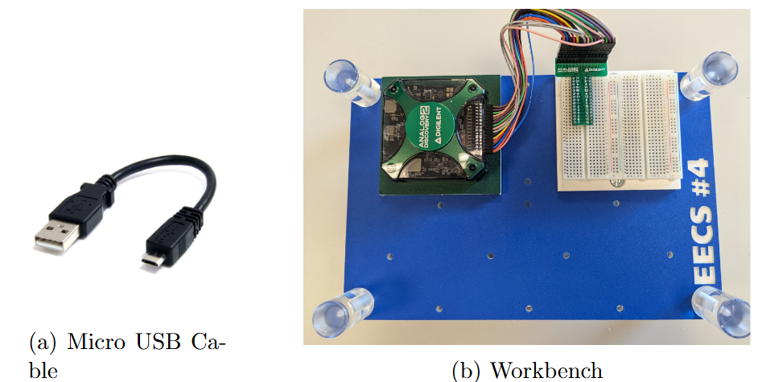
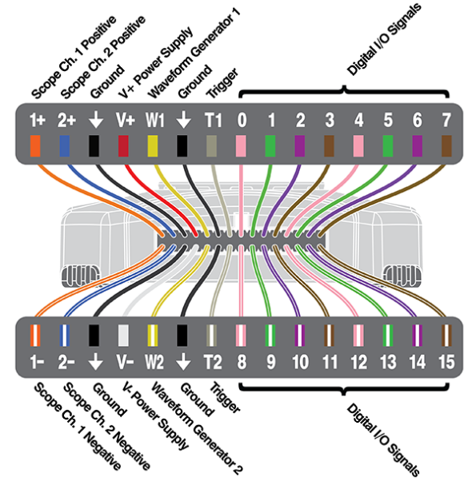
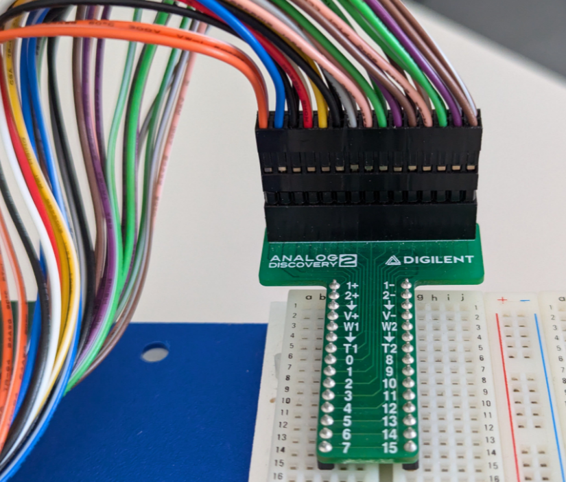
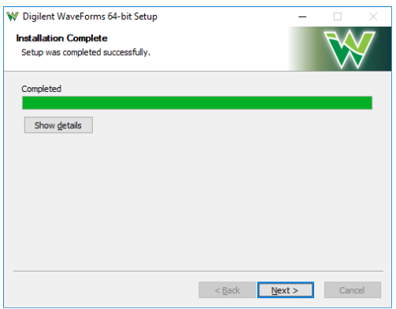
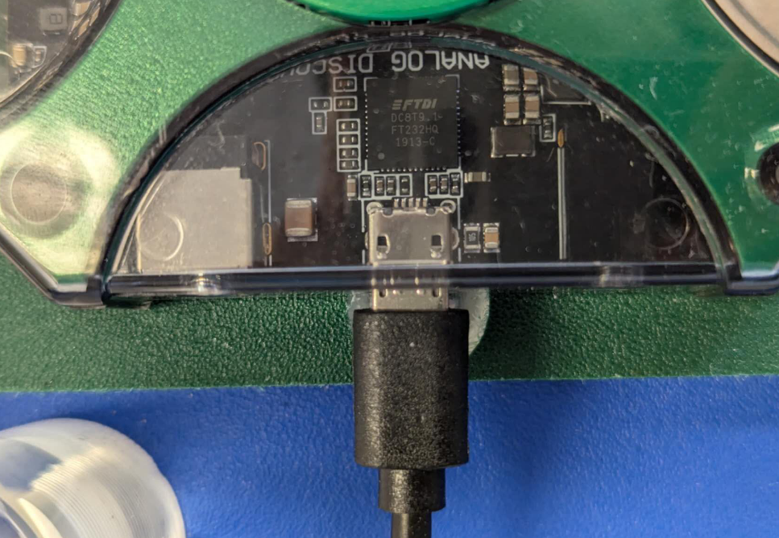

# Lab 0 Software Installation
## :dart: Task 1 – Digilent WaveForms
---

#### 📌 Task 1.1 Know the hardware

Each group should get:
- One **Micro USB Cable**
- One **blue workbench**

 

Leave the USB unconnected for now. The main component of the workbench is the **Analog Discovery 2** — a portable device that includes an oscilloscope, power supply, waveform generator, network analyzer, and more.

The pinout is shown on the left below. These pins are connected to a breadboard using a T-shaped connector. The T-shape connector neatly
organize wires from the Analog Discovery 2 for easier connection.

|pinout|from pinout to breadboard|
|---------|---------|
|  |  |

---

#### 📌 Task 1.2 Install the Software

Visit:  
🔗 https://digilent.com/reference/software/waveforms/waveforms-3/previous-versions

Install with **admin rights**. Successful installation will show a confirmation screen.

 

---

#### 📌 Task 1.3 Verify Installation

1. Connect Analog Discovery 2 to your laptop via USB.

| Bad: loose connection |
|:---------------------:|
|  |

2. Open WaveForms. A “Device Manager” window should list “Discovery2” with a serial number.
3. Click **Select**. If successful, the green light on the device will **blink**.

✅ **Check Point 1** — Light blinking green  
🎯 Get it checked by your TA/instructor.

