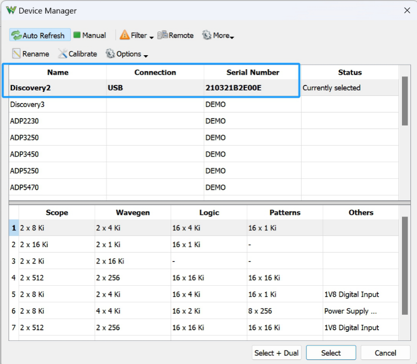

# Lab 0 Software Installation
## :dart: Task 1 – Digilent WaveForms
---

### 📌 Task 1.1 Know the hardware

Each group should get:
- One **Micro USB Cable**
- One **blue workbench**

 

Leave the USB unconnected for now. The main component of the workbench is the **Analog Discovery 2** — a portable device that includes an oscilloscope, power supply, waveform generator, network analyzer, and more.

The pinout is shown on the left below. These pins are connected to a breadboard using a T-shaped connector. The T-shape connector neatly
organize wires from the Analog Discovery 2 for easier connection.

|pinout|from pinout to breadboard|
|---------|---------|
|  |  |

---

### 📌 Task 1.2 Install the Software

Visit:  
🔗 https://digilent.com/reference/software/waveforms/waveforms-3/previous-versions

Install with **admin rights**. Successful installation will show a confirmation screen.

 

---

### 📌 Task 1.3 Verify Installation

1. Connect Analog Discovery 2 to your laptop via Micro USB Cable.

| Bad: loose connection |
|:---------------------:|
|  |

2. Open WaveForms. A **Device Manager** window should list **Discovery2** with a serial number. This indicates that your computer has suc-
cessfully detected the Analog Discovery 2.

 

3. On the the Device Manager window, keep the “Scope - Wavegen - Logic - Patterns - Others” row as default. Then,
click **Select**. If successful, the green light on the device will **blink**.

### ✅ Check Point 1 — Light blinking green

Show the blinking green light to your instructor/TA.

> _Throughout this semester: when you hit a Check Point, stop and show your result to your instructor/TA._
