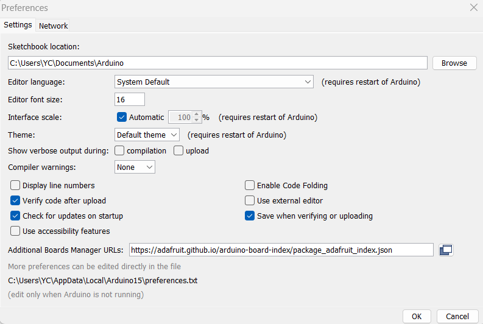
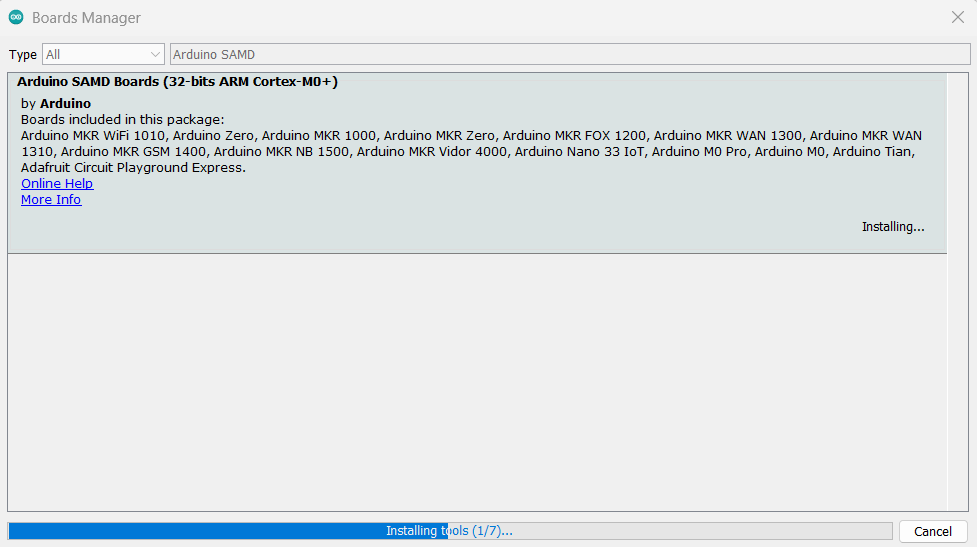
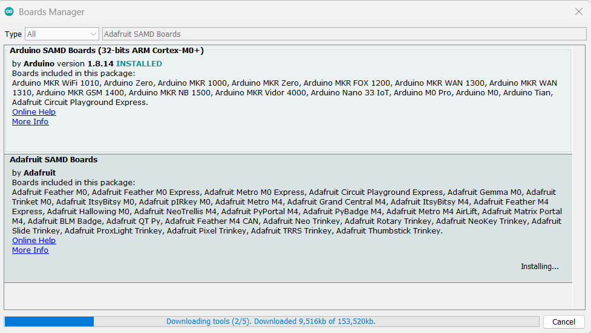

# Lab 0 Software Installation
## :dart: Task 2 – Arduino IDE
---

### 📌 Task 2.1 Install the Software

##### 🧷 Step 1: Install Arduino IDE

Go to:  
 https://www.arduino.cc/en/software/  
Download and install: **Arduino Legacy IDE 1.8.X**

❗ If you already have Arduino IDE 2.X, uninstall it firstly.

##### 🧷 Step 2: Add Adafruit Board Manager URL

In Arduino IDE:  
Go to `File → Preferences`  
Add this to **Additional Board Manager URLs**:  

```
https://adafruit.github.io/arduino-board-index/package_adafruit_index.json
```

:grey_exclamation: If you are in Mac OS, the window is located at "Arduino (the one left to File) → Settings"

 

##### 🧷 Step 3: Install Drivers

Go to `Tools → Board → Board Manager`  
Install the following one by one:

- Arduino SAMD Boards (32-bits ARM Cortex-M0+)

  In the Board Manager, set the “Type” as “All”. 
  In the search bar, type “Arduino SAMD”
  and press enter to search. You will then see a block with title “Arduino SAMD Boards
  (32-bits ARM Cortext-M0+)”. Install this one.

- Adafruit SAMD Boards

  In the search bar, type “Adafruit SAMD Boards” and press enter to search. You will
  then see a block with title “Adafruit SAMD Boards”. Install this one.

|Arduino SAMD Boards (32-bits ARM Cortex-M0+)|Adafruit SAMD Boards|
|---------|---------|
|  |  |

-----

### 📌 Task 2.2 Verify installation

##### 🧷 Step 1: Restart Arduino IDE. Select board:  
   `Tools → Board → Adafruit ItsyBitsy M0 Express (SAMD21)`
##### 🧷 Step 2: Select port (COM?: such as COM3, COM4, ...)  
   (Mac users: `/dev/cu...`)
##### 🧷 Step 3: Upload a sample code:  
   `File → Examples → 0.1 Basics → Blink`

Upload and verify that the red light blinks every second.

❗ If cannot find the port, quickly double-press the RESET button. Then go back to the IDE and check.

-----

### ✅ Check Point 2 — Light blinking red and IDE version

Show the blinking red light, your Arduino IDE version to your instructor/TA.

> _Throughout this semester: when you hit a Check Point, stop and show your result to your instructor/TA._
