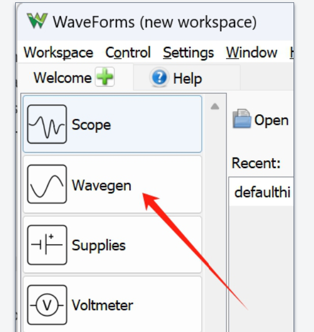
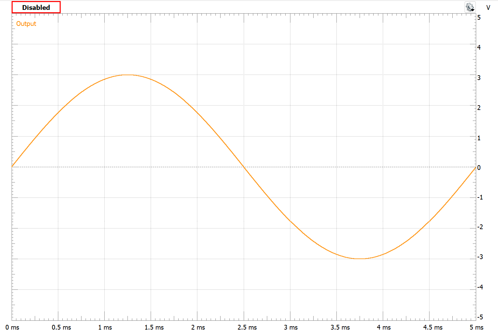
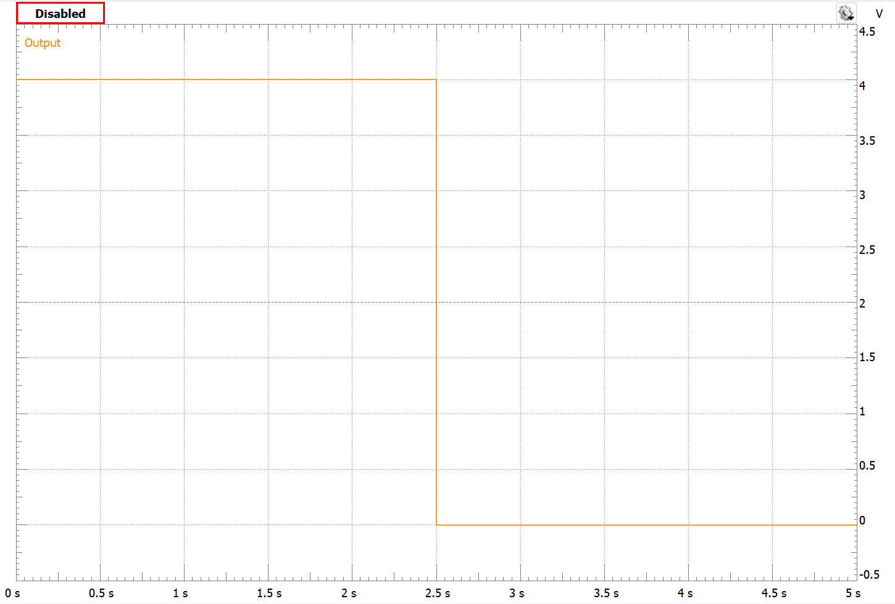

# Lab 1 Lab Basic Skills


#### :pencil2:  Preparation – start your report writing

This lab requires you to use Jupyter Notebook to write individual lab reports.  

So, before you start your lab work, open a new notebook in Jupyter Lab. Write down the following info in the header of your notebook:

```
# Lab 1 Report: Lab Basic Skills`  
### Yue Cao. Group member: Duane Marcy`  
### Lab completed on: Jan 1, 2026`
```


## :dart: Task 1 – Use Wavegen
---

Each group, get one workbench. 

Connect the Analog Discovery to your laptop. Make sure that you select an available Serial Number and the green light is blinking.  

Open the WaveForms software in your laptop. Then on the left panel, open **Wavegen**. 

**This Wavegen is essentially a function generator. It serves as the source of your circuit.**

 

By default, you will see a sine wave displayed. The left panel is where you can configure the signal, and the right plot shows how the signal looks.  

- “Frequency” and “Period” are associated:  
  $f = \frac{1}{T}$  
- “Offset” adjusts the signal’s position along the Y-axis.  

---

#### 📌
Now, explore the left-panel settings. Use  **Sine** signal type.  Set Symmetry as 50%, Phase as 0. Try to generate this plot:  

 

---

#### :pencil2:  Report Item 1-a
> **Record these Wavegen settings in your Jupyter notebook.**  

| Setting   | Value |
| --------- | ----- |
| Frequency |       |
| Period  |       |
| Amplitude |       |
| Offset    |       |

*Don’t forget the units!*  

----------

#### 📌

Continue to explore the left-panel settings. Use  **Square** signal type. Try to generate this plot: 

 

---

#### :pencil2:  Report Item 1-b
> **Record these Wavegen settings in your Jupyter notebook.**  

| Setting   | Value |
| --------- | ----- |
| Frequency |       |
| Period  |       |
| Amplitude |       |
| Offset    |       |

*Don’t forget the units!*  


---------

### ✅ Check Point 1 — 2 Tables Data


Show the data of your 2 tables to your instructor/TA.
