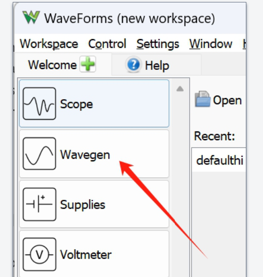
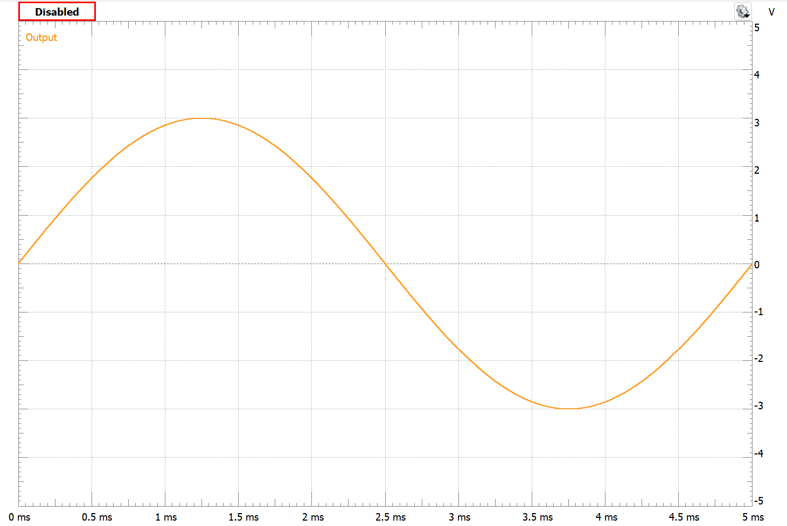
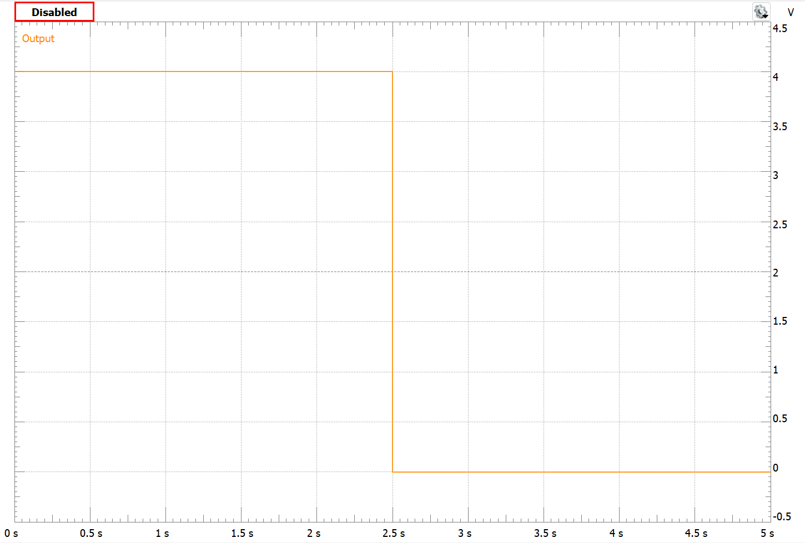

# Lab 1 Lab Basic Skills


#### :pencil2:  Preparation – start your report writing

This lab requires you to use Jupyter Notebook to write individual lab reports.  

You can get Jupyter Notebook by two approaches:

1) Local installation: First download and install Anaconda, link: https://www.anaconda.com/download/success or https://repo.anaconda.com/archive/ .
<br> Then open Anaconda Navigator, install Jupyter Lab inside.
2) Cloud use: Direct use https://colab.research.google.com/ 

Once you have it. Open a new notebook. Write down the following info in the header of your notebook:

**(Markdown cell)**
```
### Lab 1 Report: Lab Basic Skills  
#### Author: [Your own name], Group member: [another student's name]
#### Workbench number: [1 - 15 ?], Lab completed on: Sept 1, 2026
```
Enter Shift+Enter of your keyboard to display the text rendering.

Next, run this code piece to display your info in the report to guarantee the work is individual.

**(Code cell)**
```python
import platform
import socket
print(f"  Hostname: {socket.gethostname()}")
print(f"  Operating System: {platform.system()}")
print(f"  OS Version: {platform.version()}")
```


## :dart: Task 1 – Use Wavegen
---

Each group, get one workbench. 

Connect the Analog Discovery to your laptop. Make sure that you select an available Serial Number and the green light is blinking.  

Open the WaveForms software in your laptop. Then on the left panel, open **Wavegen**. 

**This Wavegen is essentially a function generator. It serves as the source (input) of your circuit.**

 

By default, you will see a sine wave displayed. The left panel is where you can configure the signal, and the right plot shows how the signal looks.  

- “Frequency” and “Period” are associated:  $f = \dfrac{1}{T}$  
- “Offset” adjusts the signal’s position along the Y-axis.  

---

### 📌 Task 1.1
Now, explore the left-panel settings. Use  **Sine** signal type. Set Symmetry as 50%, Phase as 0. Try to generate this plot:  

 

---

#### :pencil2:  Report Item 1-a
> **Record these Wavegen settings in your Jupyter notebook.**  
> To do so in Jupyter notebook, Start a new section using horizontal Rule and sub-Header ``### Report Item 1-a```.

| Setting   | Value |
| --------- | ----- |
| Frequency |       |
| Period  |       |
| Amplitude |       |
| Offset    |       |

*Don’t forget the units!*  

----------

### 📌 Task 1.2

Continue to explore the left-panel settings. Use  **Square** signal type. Set Symmetry as 50%, Phase as 0. Try to generate this plot: 

 

---

#### :pencil2:  Report Item 1-b
> **Record these Wavegen settings in your Jupyter notebook.**  

| Setting   | Value |
| --------- | ----- |
| Frequency |       |
| Period  |       |
| Amplitude |       |
| Offset    |       |

*Don’t forget the units!*  


---------

### ✅ Check Point 1 — 2 Tables Data


Show the data of your 2 tables to your instructor/TA.


