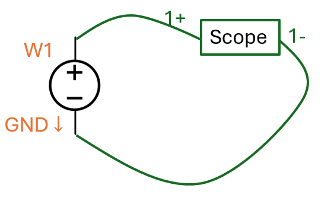
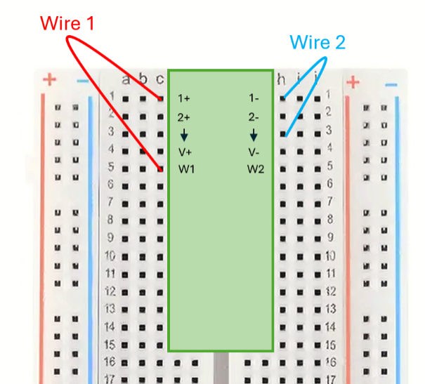
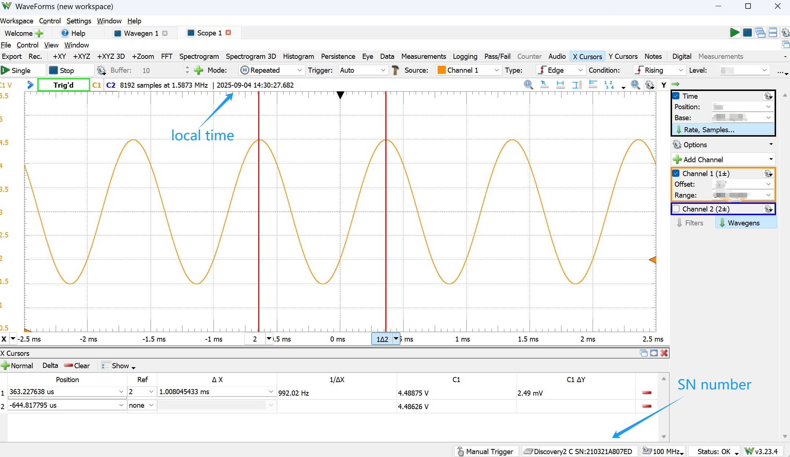

# Lab 1 Lab Basic Skills

## :dart: Task 2 – Use Scope
---

Continue with the Analog Discovery and WaveForms software.

In this part, we will use the **Scope** to measure a signal. This Scope is a **short name for Oscilloscope.**

The scope is designed to take very small current, so it is almost like an **open circuit**.

Scope measures the **time-varying voltage** across its 2 probes without disturbing the circuit.

### 📌 Task 2.1 Wire a circuit

Wire up such a circuit:

|Diagram|Wiring|
|---------|---------|
|  |  |

**Pin-to-Pin Explained:**  

- `1+` : Scope Ch.1 Positive → `W1` (Wavegen output)  
- `1-` : Scope Ch.1 Negative → `GND` (Ground)  

$\text{Measured Voltage} = \text{Signal}(1+) - \text{Signal}(1-) = \text{Signal(W1)} - 0 = \text{Signal(W1)}$

### 📌 Task 2.2 Configure source

Recall in Task 1, you have explored the Wavegen.

Now configure it as:

| Setting   | Value |
| --------- | ----- |
| Type | Sine      |
| Frequency |   1 kHz    |
| Period  |    1 ms   |
| Amplitude |   1.5 V  |
| Offset    |    3 V   |

After setting up your **Wavegen**, activate it by clicking **Run** (green arrow icon :arrow_forward:) in Wavegen. The device will now output a voltage signal through **W1** (default).  

### 📌 Task 2.3 Adjust scope display

In WaveForms, open **Scope**.  Click the  **Run** (green arrow icon :arrow_forward:). Use **Repeated** Mode.

It is likely to get a signal messing around. To adjust this:

##### 🧷 Step 1: Place the signal on center with better scale

Go to the right-side panel, Adjust the 1 or more of these:

- **Time-Base** → sets the X-axis scale (time per division) 
- **Channel 1-Offset** → shifts the signal vertically (moves up/down)   
- **Channel 1-Range**→ sets the Y-axis scale (volts per division)

❗Always keep **Time-Position** as 0

❗Don't use the middle wheel of mouse to scroll

**Try to display ~3–5 cycles and ~50%  height on screen.**

##### 🧷 Step 2: Stabilize the signal

**Triggering** is a way to let the scope “lock” onto a repeating signal so it looks stable on the display.

* The scope continuously captures small slices of the signal (acquisition windows).
* Without a trigger, these slices start at random points, and the display scrolls.
* A **trigger condition** tells the scope where to capture each slice.
* This ensures each cycle is aligned, so the signal looks steady, instead of scrolling.

In your Scope, use 

- Type = Edge  
- Condition = Rising  
- Level = ? V  

This means such **trigger condition**: when the signal rises thru ? V, that point is used as the **trigger point**. The scope then places the acquisition window (slice) 's center at this trigger point.

**Try a find a suitable ? V Level to stabilize the signal**

---

#### :pencil2:  Report Item 2-a
> **Indicate the trigger level that you find. Use a full sentence to answer.**  

---

#### :pencil2:  Report Item 2-b

> **Record your Scope setting in a Table.**  

| Setting   | Value |
| --------- | ----- |
| Time-Position |      |
| Time-Base |      |
| Channel 1-Offset |      |
| Channel 1-Range |    |

*Don’t forget the units!*  

### 📌 Task 2.4 Measure the signal

Scope has 3 measurement tools:  

1. **Quick Measure**  
2. **Predefined Measurements** 
3. **Cursor**  
   

Try all these 3 tools to measure the period of your signal (the distance between two nearest peaks).

#### :pencil2:  Report Item 2-c

> Provide the screenshot of the final display using the Cursor tool. Include the local time and device Serial Number (Discovery 2 C SN: ..) in the screenshot. 

> To do so, Use computer-built-in app to screenshot. Not use your phone camera to take pictures.

> Copy the screenshot image from your folder in computer, and then directly paste it (ctrl+V) into a Markdown cell in Jupyter Notebook.

**Example:**

  

 

---------

### ✅ Check Point 2 — Final picture in Jupyter Notebook

Show to your instructor/TA.
