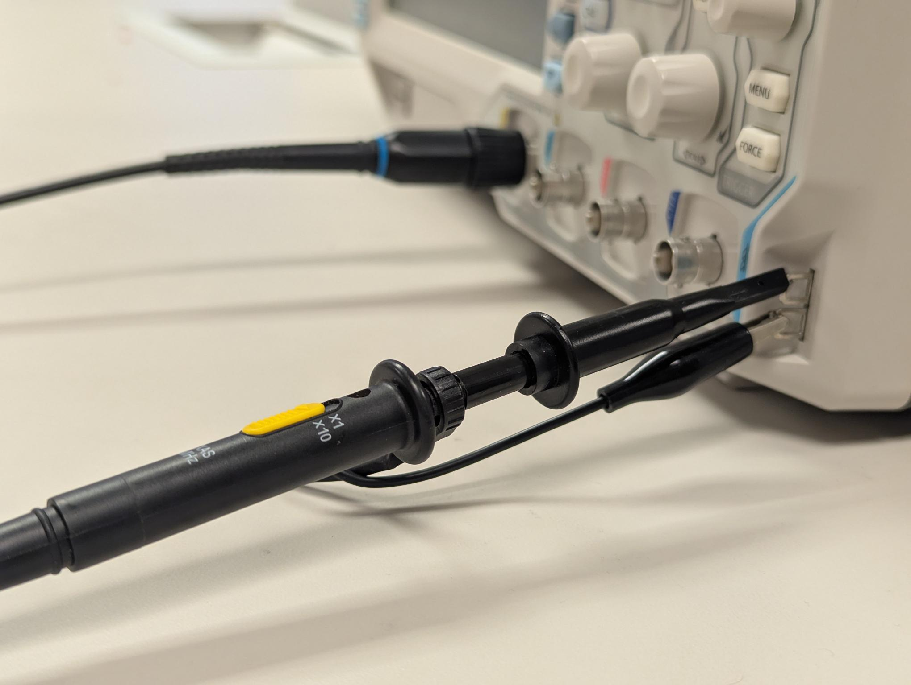
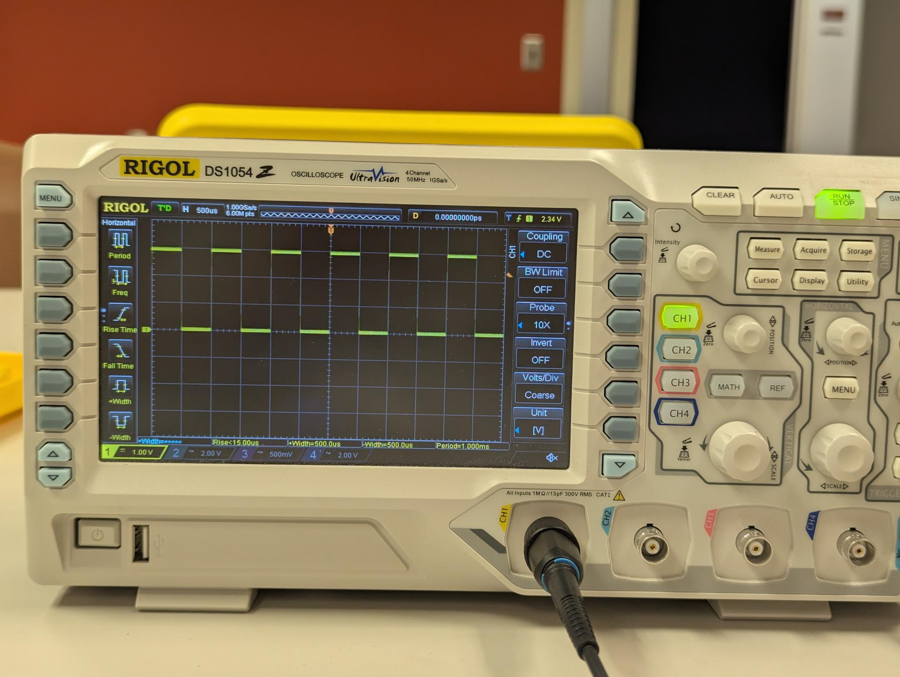

## 🔵 Bonus Grade Policy
During this semester, there will be opportunities to earn bonus points in **Lab 2, 3, 4, 5, 7, 8**.

All bonus activities are related to benchtop oscilloscope (Scope) usage.

Each bonus lab is worth **5 points**. A max of 4 bonus labs will be counted, for up to **20 bonus points** toward your final course grade.

## 🔵 Lab 1 

> [!NOTE]
> 
> In Lab 1, you will explore the basic usage of the benchtop oscilloscope.
>
> There are **no bonus points for Lab 1**, but this lab is important because it shows oscilloscope basics for later labs.

### Introduction 

In the room, we have four benchtop oscilloscope available for use

**Rigol Digital Oscilloscope DS1054Z**, https://www.amazon.com/dp/B012938E76

 

Rigol produces entry-level oscilloscopes at affordable prices (under 1k).

In the future, if you work in the EE industry, you may use oscilloscopes made by the Keysight company. Their oscilloscopes are high-end and significantly more expensive (price in 5 or 6 figures).

------

### Start with the first signal

One good start point is using the internal calibration signal. This is a quick check setup without using any external source.

You can follow this short guide and try it: http://kofa.mmto.arizona.edu/electronics/rigol/tutorial/first.html

I also details here:

- [ ] Connect a probe cable to CH1.
- [ ] Set the probe at **10x**, instead of **1x** (1× probe: 1 MΩ input impedance; 10× probe: 10 MΩ input impedance. Higher input impedance draws less current from the original circuit, thus affect less to the circuit.)
- [ ] Turn on the Scope.
- [ ]  Look at the lower-right side of the oscilloscope. You will see two rectangular test terminals. These provide an internal reference signal for probe calibration or a quick oscilloscope check.
- [ ] Connect the probe tip to the upper terminal; Connect the ground clip to the lower terminal.

 

- [ ] Go to the Scope screen. In the CH1 settings, make sure the probe setting matches 10×.
- [ ] Make sure the trigger level is set between the minimum and maximum voltage levels of the signal.
- [ ] Adjust the oscilloscope controls, playing with the knobs and buttons, until you can see a clear and stable 3V, 1 kHz square wave.  

 

------

**The best way to learn is to try the different buttons and knobs and see what they do.** 

> Don’t worry if you mess up the settings. You can ask the instructor/TA to reset it.
>
> Or you can reset on your own: press the "Storage" button, then select the "Default" option.

Once done, you can scramble some settings of the Scope, so the next group students can practice and explore.
