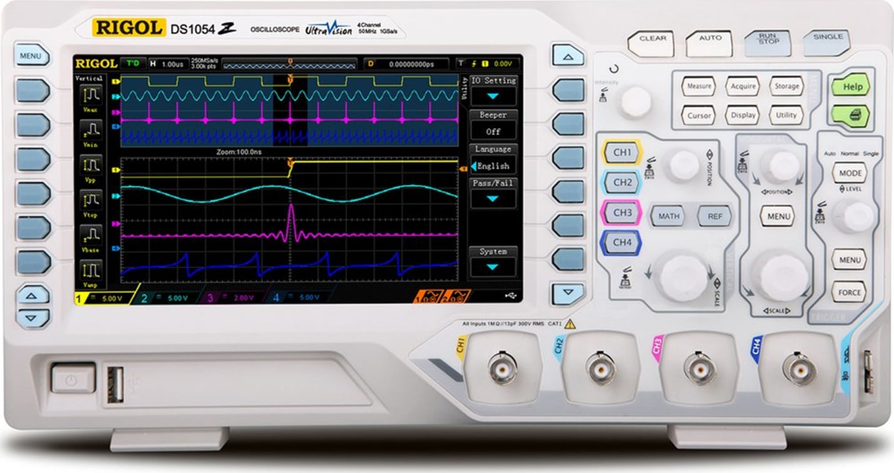

## 🔵 Bonus Grade Policy
During this semester, there will be opportunities to earn bonus points in **Lab 2, 3, 4, 5, 7, 8**.

All bonus activities are related to benchtop oscilloscope (Scope) usage.

Each bonus lab is worth **5 points**. A max of 4 bonus labs will be counted, for up to **20 bonus points** toward your final course grade.

## 🔵 Lab 1 

> [!NOTE]
> 
> In Lab 1, we will show you basic usage of the benchtop oscilloscope.
>
> There are **no bonus points for Lab 1**, but this lab is important because it provides the foundation for the oscilloscope bonus activities in later labs.

### Introduction 

In the room, we have four benchtop oscilloscope available for use

**Rigol Digital Oscilloscope DS1054Z**, https://www.amazon.com/dp/B012938E76

 

Rigol produces entry-level oscilloscopes at affordable prices (under 1k).

In the future, if you work in the EE industry, you may use oscilloscopes made by the Keysight company. Their oscilloscopes are high-end and significantly more expensive (price in 5-or-6 figures).

------

### Start with the first signal

One good start point is using the internal calibration signal. This is a quick check setup without using any external source.

To be written http://kofa.mmto.arizona.edu/electronics/rigol/tutorial/first.html
