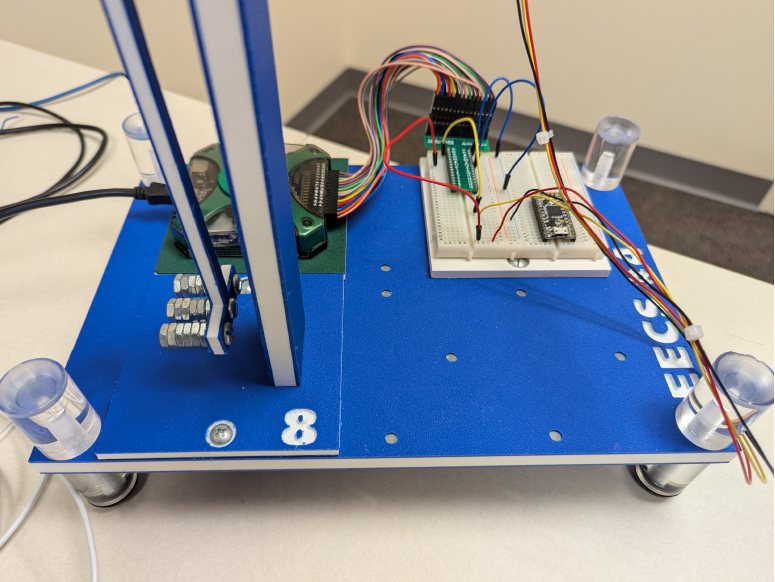
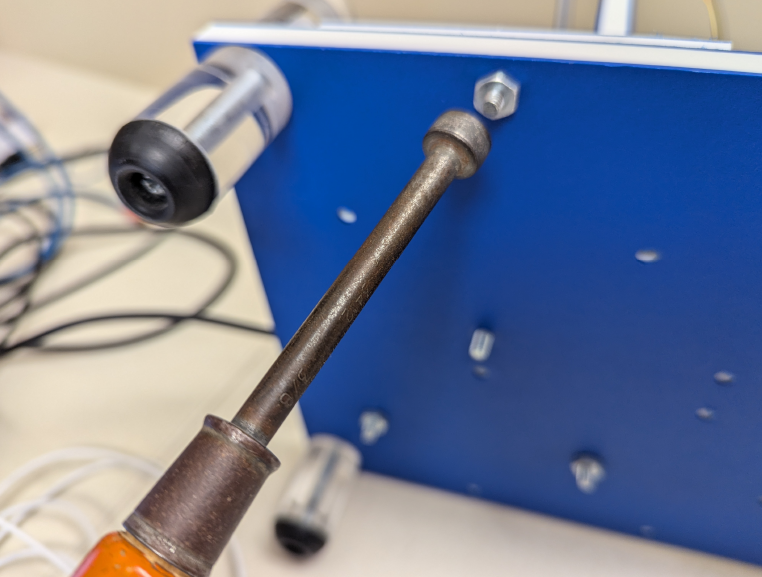

# Lab 10 Pendulum II

## :dart: Task 1 – Set up the Pendulum

---
### 📌 Task 1.1 Set-up
We will repeat the same set-up and wiring as the lab last week.

You should refer to the details in 

|  |  |
|---------------------|------------------------------|
|  |  |

---

---
### 

|      |      |      |
| ---- | ---- | ---- |
|      |      |      |

#### :pencil2:  Report Item 1-a

Record the measured $V_{out}$ in the table.

| **Rotation**                      | **Theoretical $V_{out}$** | **Arduino Serial Monitor** | **Analog Discovery** |
|:------------:|:--------------:|:--------:|:--------:|
| 180° |               1.65 V                 |                            |                      |

---
### ✅ You can disconnect all wires to Analog Discovery. Proceed to Task 2. No Check Point here.

