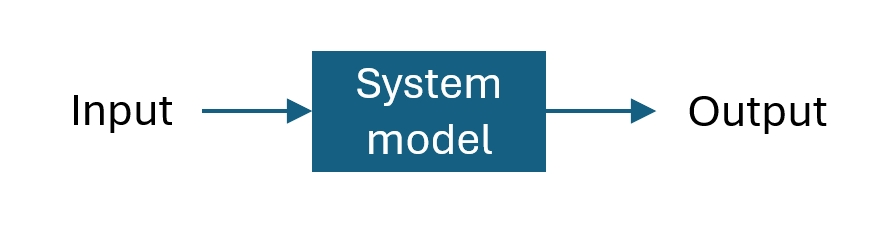

# Lab 1 Impulse Response

## :dart: Task 1 – System Modeling
---

In this lab, we will use a **series RL** circuit to model a first-order system.

 

We want to treat the circuit as a **System** . 

 

Thus we need to specify the following:

- **System Input:** We set the voltage of the power source, $V_{in}(t)$, as the system input.  
  This can be set-up via Wavegen in the WaveForms.
- **System Output:** We set the voltage of the resistor $V_{R}(t)$ as the system output.  
  This can be measured via Scope in the WaveForms.

- **System Model:** To be calculated

