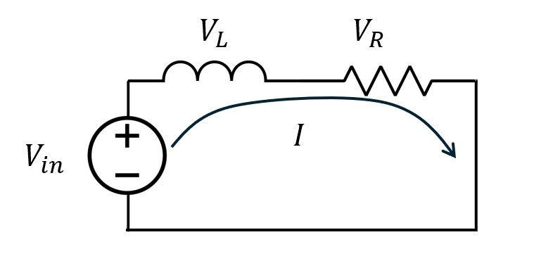
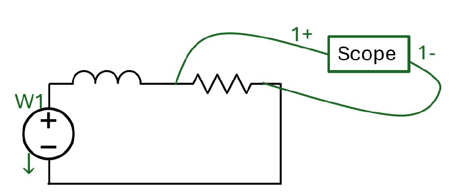

# Lab 2 Impulse Response

## :dart: Task 2 – Obtain System Response
---

### 📌 Task 2.1 RL Circuit Setup

| **Circuit Diagram** | **Breadboard Pin** |
|---------------------|------------------------------|
|  |  |

**Components:**
- $R = 22~\Omega$ resistor, (color code: red red black gold)
- $L = 1~\mathrm{mH}$ inductor  

### 📌 Task 2.1 Input Setup
**Input Signal is setup by Wavegen setup:**
| Setting   | Value |
| --------- | ----- |
| Type |  Square     |
| Period  |    1 ms   |
| Amplitude |   1 V    |
| Offset    |   1 V    |
| Symmetry    |   1 %    |
| Phase    |   0    |

For such setting, the area of this signal is,

$$
2~\mathrm{V} \times 1~\mathrm{ms} \times 1\% 
= 2 \times 10^{-3}~\mathrm{V \cdot s} \times 0.01
= 2 \times 10^{-5}~\mathrm{V \cdot s}
$$
