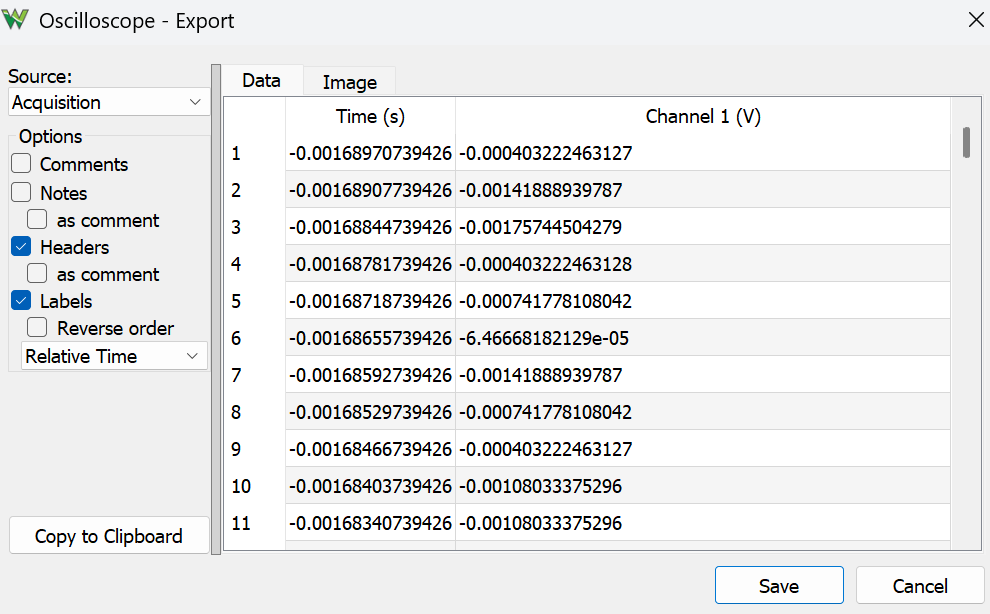

# Lab 2 Impulse Response


## :dart: Task 3 – Store and Analyze Data
----------
### 📌 Task 3.1 Export Scope Data

In your Scope, with the result from the last task displayed, click the **Export** to save data as .csv format.

For the export setting,

* Uncheck **Notes**
* Check **Header**
* Check **Labels**

 

----------
### 📌 Task 3.2 Data into Python (Individual)

1. Open your lab report Jupyter Notebook in **JupyterLab**.  
2. Locate the saved **.csv** data file on your folder.  
3. Drag and drop the **.csv** data file into the **file browser panel** on the left side of JupyterLab.  
4. Confirm that your notebook file and data file are now in the **same folder** .

Then, in your report, start a Code cell and paste the following,

```python
import pandas as pd
import matplotlib.pyplot as plt

# Read data
file_path = 'your_data_file.csv'
cao_lab2_data = pd.read_csv(file_path, sep=',', comment='#', skip_blank_lines=True)
# cao_lab2_data is just a Variable name, you can name it as whatever.
# It is a Pandas DataFrame object (like a table in Excel). 


# Plot data
plt.figure(figsize=(12, 5))
plt.plot(cao_lab2_data['Time (s)'], cao_lab2_data['Channel 1 (V)'])
plt.xlabel('???')
plt.ylabel('???')
plt.title('???')
plt.grid(True)
```


#### :pencil2:  Report Item 3-a
Use Python to display the plot of your data.  

Make sure the plot has **axis labels** (with units) and a **title**.  

### ✅ Check Point 2 — Python Plot
You may now disconnect and put away all hardware.  
- Return resistor, inductor to their proper bins.  
- Place the blue workbench on the shelf in the correct order:  
  *(EECS 1–2, EECS 3–4, EECS 5–6, …)*  

----------
### 📌 Task 3.3 Data Analysis (Individual)

Next, use ```print (cao_lab2_data["Channel 1 (V)"].max())``` in Python to obtain the peak voltage.

#### :pencil2:  Report Item 3-b
Show the result your peak voltage in Python.

#### :pencil2:  Report Item 3-c
Theoretical response calculation.

Baed on the experiment, plug in the values of $R$, $L$, $A$ into the equation you got back in Task 1:

$$V_{out}(t) = ???$$

The theoretical peak value of $V_{out}(t)$ for $t\geq0$ is $???$


#### :pencil2:  Report Item 3-d

Compare the peak voltage you obtained from experiment versus the one from 3-c calculation. Fill:

| **Tool**        | Experimental Peak Voltage | Percent Error |
|-----------------|----|----|
| **Scope**| ?? |?? |
| **Python**| ?? |?? |

> [!TIP]
> Scope Experimental is from Report Item 2-b; Python Experimental is from Report Item 3-b;
> 
> Percent Error is Experimental versus Theoretical.
