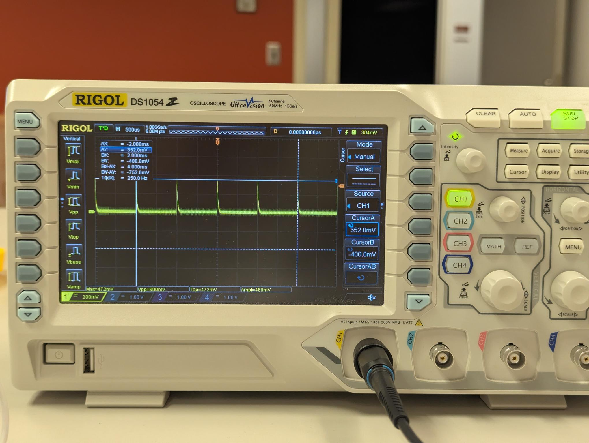

## 🔵 Oscilloscope Bonus Grade Policy
During this semester, there will be opportunities to earn bonus points in **Lab 2, 3, 4, 5, 7, 8**.

All bonus activities are related to benchtop oscilloscope (Scope) usage.

Each bonus lab is worth **5 points**. A max of 4 bonus labs will be counted, for up to **20 bonus points** toward your final course grade.

## 🔵 Lab 2

> [!NOTE]
> 
> You can go back to [Lab 1 Scope Intro](../Lab%201%20Basic%20Lab%20Skills/Lab%201_Oscilloscope_Bonus.md) to recap basic operations.

Go back to your RL circuit in [Lab 2 Task 2](Lab%202%20Main%20Task%202.md).

- [ ] Use the oscilloscope probe to obtain the same voltage $V_R$ in Task 2..

- [ ] Adjust the knobs and buttons, until you see a clear signal (similar as your saw from Analog Discovery.)

- [ ] Then use the "Cursor" on the scope panel to measure the peak voltage of your signal. 
In the room, we have four benchtop oscilloscope available for use

---

### ✅ Bonus Check 

**Show to the instructor and explain the operation.** Then obtain the check for bonus. 

 
