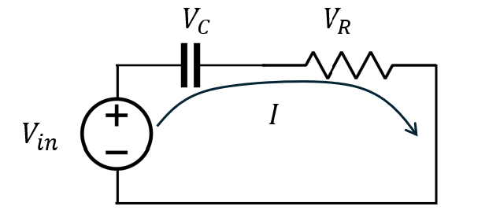
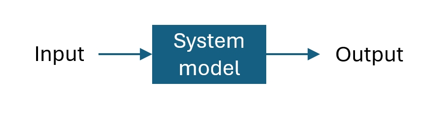

# Lab 3 Step Response

## :dart: Task 1 – System Modeling
---

In this lab, we will use a **series RC** circuit to model a first-order system.

 

We want to treat the circuit as a **System** . 

 

- **System input:** $V_{in}(t)$ 
- **System output:** $V_{out}(t)=V_{C}(t)$ 
- **System model:** To be calculated

### 📌 Task 1.1 Derive the System Model (Individual)

Analyze the circuit, we have:

$$
V_{in}(t) =  V_C(t) + V_R(t) = \frac{1}{C}\int I(t)dt + I(t)R 
$$

$$
V_{out}(t) = V_C(t) = \frac{1}{C}\int i(t)dt
$$

Apply Laplace Transform:

$$
V_{in}(s) =  \frac{1}{C}\frac{I(s)}{s} + I(s)R 
$$

$$
V_{out}(s) = \frac{1}{C}\frac{I(s)}{s}
$$

#### :pencil2:  Report Item 1-a
Find the system model in Laplace domain (known as Transfer Function):
 
$$
\frac{V_{out}(s)}{V_{in}(s)} = ???
$$

*Make coefficient of the highest order term in the denominator equal to 1.*

*Note again: For typing math answers in the report, you need to type the entire
equation and a short text description, not only type the part corresponding to ???.
This rubric applies to all math answers in the semester.*

---

### 📌 Task 1.2 Caculate Step Response in Theory (Individual)

Today, our input will be a unit step signal. Let's write it as

$$
V_{in}(t) = u(t)
$$

Convert to Laplace domain is:

$$V_{in}(s)=\mathcal{L} (u(t))=\frac{1}{s}$$
