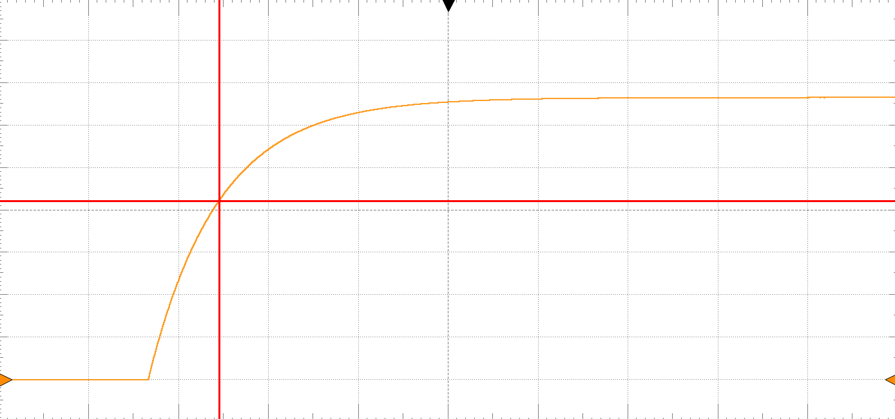

# Lab 3 Step Response

## :dart: Task 2 – Obtain System Response
---
### 📌 Task 2.1 RC Circuit Setup

| **Circuit Diagram** | **Breadboard Pin** |
|---------------------|------------------------------|
|  |  |

**Components Used:**
- $R = 100~\mathrm{k}\Omega$ resistor 
- $L = 0.22~\mu\mathrm{F}$ capacitor

-------------
### 📌 Task 2.2 Input Setup
**Input Signal is setup by Wavegen setup:**
| Setting   | Value |
| --------- | ----- |
| Type |  Square     |
| Period  |    1 s   |
| Amplitude |   1 V    |
| Offset    |   1 V    |
| Symmetry    |   50 %    |
| Phase    |   0    |

This setting generates a step input $2u(t)$, whose amplitude jumps from 0 V to 2 V.

---
### 📌 Task 2.3 Obtain Output
Run the Wavegen to generate the signal.

Run the Scope to measure the voltage across the capacitor.

Adjust the scope to get a clear, readable display. You should get **only 1 exponential increase** clearly in the display.
  
> [!TIP]
> 1. the signal is not stable, adjust the **Trigger Level** until the display locks.  
> 2. If the signal looks too compressed or stretched in Time axis, adjust the **Time-Base**.  
> 3. If the signal looks too compressed or stretched in Voltage axis, adjust the **Channel 1-Range**.  
> 4. If the entire signal is off-screen (up or below), adjust the **Channel 1-Offset**.

-------------
### 📌 Task 2.4 Measure
Recall in Task 1, you final result for step response of first order system may look like:

$$
\mathrm{Output} = K \bigl(1 - e^{-\frac{1}{\tau}t}\bigr)u(t)
$$

**$K$ (called statedy-state amplitude)** and **$\tau$ (called Time Constant)** are two constants that depend on **input amplitude $A$** and the **system model parameters $R$ and $C$**.

* **When $t=\infty$:**
  $\mathrm{Output}=K$,
  (reaches a Steady-State Amplitude).

* **When $t=\tau$:**
  $\mathrm{Output}=K\bigl(1-e^{-1}\bigr)\approx 0.632\cdot K$,
  (63.2% of the Steady-State Amplitude).

To measure $K$ and $\tau$ graphically, we need to use the **Cursor Tool** as these steps:

##### 🧷 Step 1:
Use a Y-cursor to measure the Steady-State amplitude on the scope. This is recorded as **statedy-state amplitude $K$**

##### 🧷 Step 2: 
Calculate the value $0.632\times K$

##### 🧷 Step 3: 
Use a pair of X and Y cursor to locate the point on the signal where the amplitude is equal to $0.632\times K$

##### 🧷 Step 4: 
Once you have identified this point, use 2 X cursors to measure the horizontal distance from the start of the cycle to this point. This distance is the **Time
Constant $\tau$.**

| **Step 1: align Y cursor to top** | **Step 3: Move Y cursor to $0.632\times K$** |
|---------------------|-------------------|
|  |  |

| **Step 3: Move X cursor to the location** | **Step 4: 2 X cursors for horizontal distance** |
|---------------------|-------------------|
|  |  |

#### :pencil2:  Report Item 2-c

Provide the screenshot of the display of your Scope. With final cursors and reading displayed.

> [!NOTE]
> Include the local time and device Serial Number (Discovery 2 C SN: ..) in the screenshot.
> Use computer-built-in app to screenshot. Not use your phone camera to take pictures.

#### :pencil2:  Report Item 2-b

Record your experimental results.

|||
|-----------------|----|
| **Steady-State Amplitude $K$**        | ?? |
| **$0.632\times K$**        | ?? |
|**Time Constant $\tau$**|??|

### ✅ Check Point 1 — Scope Display and Table Result

Show to your instructor/TA.

