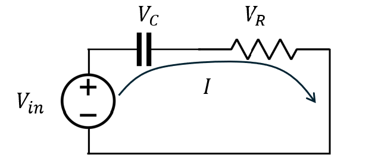
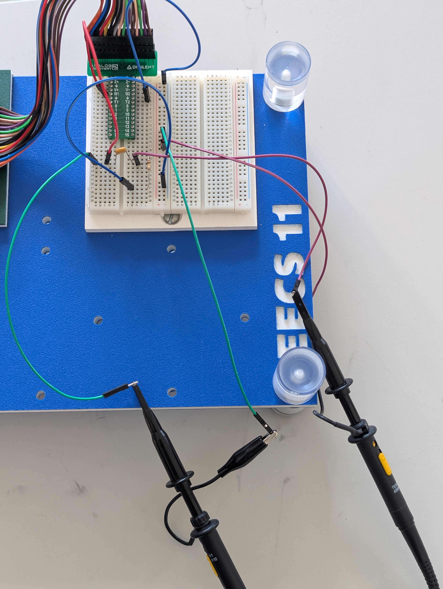
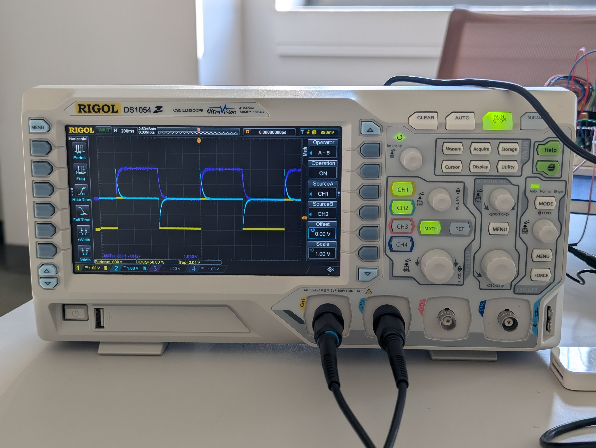

## 🔵 Oscilloscope Bonus Grade Policy
During this semester, there will be opportunities to earn bonus points in **Lab 2, 3, 4, 5, 7, 8**.

All bonus activities are related to benchtop oscilloscope (Scope) usage.

Each bonus lab is worth **5 points**. A max of 4 bonus labs will be counted, for up to **20 bonus points** toward your final course grade.

> [!NOTE]
> 
> You can go back to [← Lab 1 Scope Intro](../Lab%201%20Basic%20Lab%20Skills/Lab%201_Oscilloscope_Bonus.md) to recap basic operations.

## 🔵 Lab 3 - Measure a voltage drop

### Task

Measure the voltage drop across the capacitor in today's circuit.   Use the same step input from Wavegen (Analog Discovery). But now use benchtop scope to measure it. 

 

---

### Guide

A standard oscilloscope probe is **not differential** like the **1+ / 1−** inputs on the Analog Discovery.

| Connection           | Where to connect                     |
| -------------------- | ------------------------------------ |
| **Probe hook** | The voltage node you want to measure |
| **Ground clip**      | Circuit ground                       |

A standard probe therefore measures:

$$
V_{\text{node}}
$$

Not 

$$
V_{\text{component}}
$$

For a voltage drop across a component:

- [ ] Use **two probes / two channels**      
- [ ] CH1 measures one side of the component 
- [ ] CH2 measures the other side      
- [ ] double check whether the probes are at 10x, and CH on scope are at 10x.      
- [ ] Use **Math = CH1 − CH2**               

$$
V_{\text{component}}=\text{CH1}-\text{CH2}
$$

> [!CAUTION]
> DO NOT simply connect the probe hook and ground clip across the two terminals of a component, unless the ground-clip side is actually circuit ground.

| Probe Connection. My 2 yellow wires go to CH1, 2 purple wires go to CH2. |
|---|
|  |

| Expected Result, dark blue signal is the math result |
|---|
|  |

---

### ✅ Bonus Check 

- [ ] **Show to the instructor and explain the operation.** Then obtain the check for bonus. 

- [ ] Also **reset the scope after:**  press the "Storage" button, then select the "Default" option.

