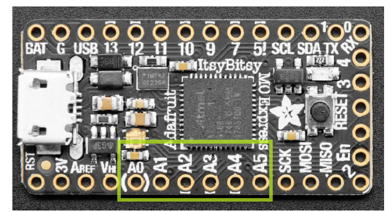
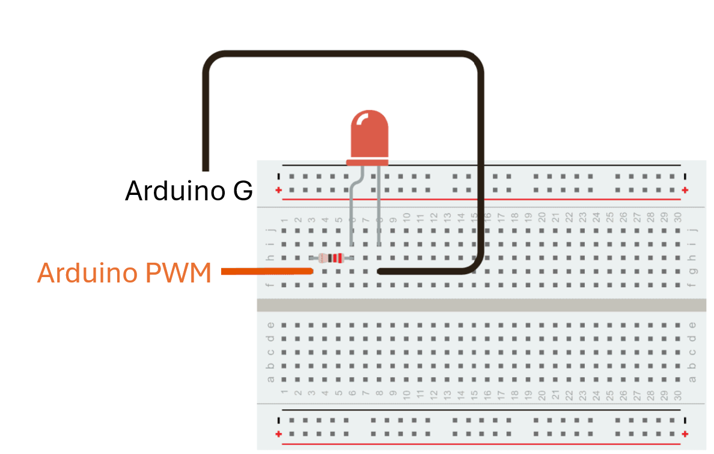
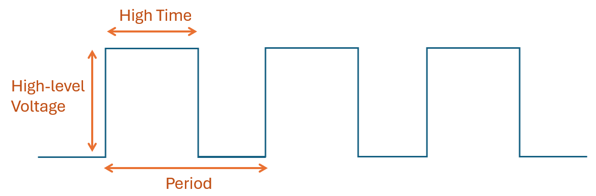

# Lab 4 Arduino I

These two labs (Lab4 & 5) will introduce Arduino basics, with emphasis on I/O.

Overall, Arduino is capable of:

* **Analog input** 
* **True analog output** (only on certain boards)
* **PWM output** 
* **Digital input**
* **Digital output**

Our lab will focus on the first 3 I/O types.

----------


The board we use is **Adafruit ItsyBitsy M0 Express**,
Its pinout can be found on 
https://github.com/adafruit/Adafruit-ItsyBitsy-M0-PCB/blob/master/Adafruit%20ItsyBitsy%20M0%20pinout.pdf 

For the pinout,

* **Analog input**: All pins labeled with **AIN** can do analog input. We recommend use from **Pin A1** to **Pin A5**.
* **True analog output**: **Pin A0** is the only true analog output pin. It is labeled by **VOUT**
* **PWM output**: Most pins labeled with **D** can do PWM output. We recommend use from **Pin 9** to **Pin 13** 

## :dart: Task 1 – LED and PWM output
---
### 📌 Task 1.1 Arduino Circuit Setup
Components Used:
* one LED
* one 220 Ω resistor (color code: red red brown gold)



* Arduino G is the Ground Pin
* Arduino PWM: pick any PWM pin indicated in the previous introduction 

### 📌 Task 1.2 Arduino Code
The Arduino coding of ItsyBitsy is a little different from classic AVR Arduino (such as Uno,
Nano). When dealing with PWM in ItsyBitsy, we do not use ```pinMode(..., ...)```

Here is the code to drive your LED in full brightness. It is super simple!
```c
const int PWMPin = 10;
// Suppose use Pin 10.
void setup() {
}

void loop() {
analogWrite(PWMPin, 255);
}
```
Upload the code to Arduino. Observe the LED.

Then adjust ```analogWrite(PWMPin, 255);``` to ```analogWrite(PWMPin, 127);```. Upload again, Observe the LED.

Then adjust ```analogWrite(PWMPin, 255);``` to ```analogWrite(PWMPin, 63);```. Upload again, Observe the LED.


### 📌 Task 1.3 Measure Pin Voltage
Now, use your Analog Discovery's Scope to measure the voltage of the Arduino PWM Pin. For example, if use Channel 1 on Scope:
* Connect Analog Discovery's **1+** Pin to Arduino's **PWM** Pin
* Connect Analog Discovert's **1-** Pin to Arduino's **G** Pin

> [!TIP]
> If Scope signal is not stable, adjust the **Trigger Level** until the display locks.  
> Display 5-10 cycles on the Scope.

For ```analogWrite(PWMPin, 127);``` and ```analogWrite(PWMPin, 63);``` 
* Perform measurement for one cycle, record its High-level Voltage, High Time ($H$), Period ($T$).
* Then calculate the Duty Cycle $D = (H / T) $× 100 %
  


#### :pencil2:  Report Item 1-1

| Setting | High-level Voltage | High Time  | Period | Duty Cycle |
| ------- | ------- | ------- |  ------- |  ------- | 
| ```analogWrite(PWMPin, 127);```      |                               |                    |                    |          %    |
| ```analogWrite(PWMPin, 63);```       |                               |                    |                     |        %     |

> [!NOTE]
> Unit!
> 
> At least 3 significant figures (digits)!


