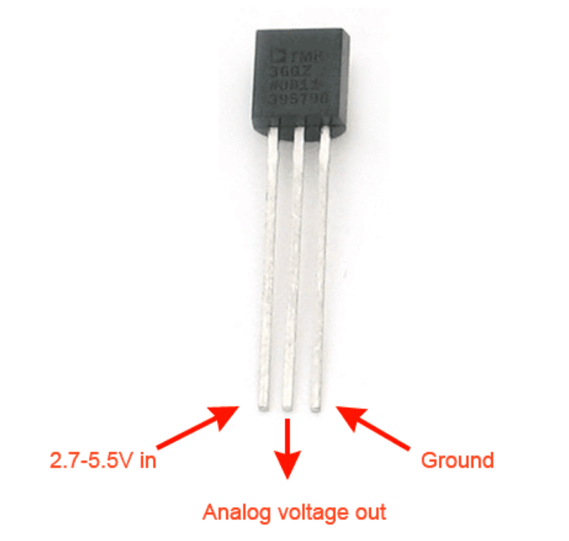

# Lab 4 Arduino I

## :dart: Task 2 – Temperature sensor reading
### 📌 Task 2.1 Circuit Setup
**Component Used**

* One Kookye TMP36 Temperature Sensor
  

Insert the three leads of the TMP36 into separate rows of the breadboard.

Make its flat surface facing toward you. This will help you correctly identify the pins.

-----
In this task, we will use the **Analog Discovery** to study the TMP36 sensor characteristics.

**Pin-to-Lead:**  
- Analog Discovery `W1` → `left lead` (TMP36='s Vin) 
- Analog Discovery `1+`  → `middle lead` (TMP36's analog voltage output)  
- Analog Discovery `1-` → Analog Discovery Ground `↓` → `right lead` (TMP36's ground) 

> [!CAUTION]  
> Never reverse the TMP 36 sensor's Vin and Gound connections.
>
> Wrong wiring can cause the sensor to overheat rapidly, even burn your finger!!

> [!TIP]  
> For easier checking, recommend to use a **red wire for Vin** and a **blue wire for Ground** when wiring the TMP36 sensor.

