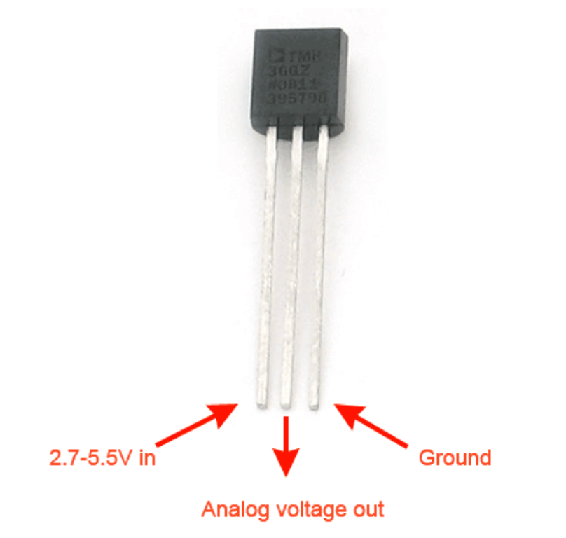

# Lab 4 Arduino I

## :dart: Task 3 – Temperature sensor & Analog Input
---
### 📌 Task 3.1 Circuit Setup
In this task, we will use the **Arduino** to get the reading from TMP36 temperature sensor.

**Pin-to-Pin:**  
- Arduino `3V` or `VHI` Pin → `left lead` (sensor's Vin) 
- Arduino Analog input Pin  → `middle lead` (sensor's analog voltage output)  
- Arduino `G` Pin  → `right lead` (sensor's ground) 

`3V` Pin is a 3.3 V source; `VHI` Pin is a 5 V source. Either one satiefies the requirement.

Arduino Analog input Pin, you can pick any one  indicated in the pre-Task 1 introduction.

