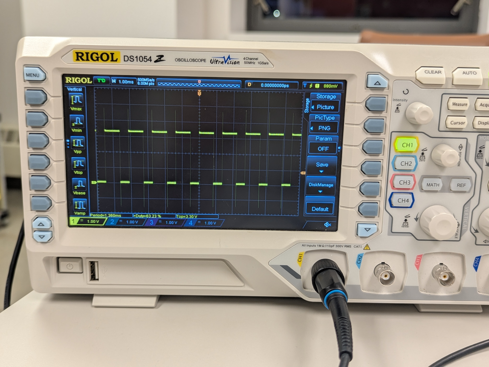

## 🔵 Oscilloscope Bonus Grade Policy
During this semester, there will be opportunities to earn bonus points in **Lab 2, 3, 4, 5, 7, 8**.

All bonus activities are related to benchtop oscilloscope (Scope) usage.

Each bonus lab is worth **5 points**. A max of 4 bonus labs will be counted, for up to **20 bonus points** toward your final course grade.

> [!NOTE]
> 
> You can go back to [← Lab 1 Scope Intro](../Lab%201%20Basic%20Lab%20Skills/Lab%201_Oscilloscope_Bonus.md) to recap basic operations.

## 🔵 Lab 4 - Use Measurement Softkeys

### Task

Repeat today's Task 1 PWM signal measrument..   Use the same input from Arduino. (either `analogWrite(PWMPin, 127);` or `analogWrite(PWMPin, 63);`)
 But now use benchtop scope to measure it. 

- [ ] Adjust signal on scope to get a clear display (not too dense or too sparse).
- [ ] Use the line of softkeys on the left side of the scope screen to perform measurement of your signal.
- [ ] Specifically, measure "Period", "Duty", "Vtop".
- [ ] You should get them displayed on the bottom of scope screen.

---

### Guide

|Expected Result, I used different value in Arduino `analogWrite` code |
|---|
|  |

---

### ✅ Bonus Check 

- [ ] The lab staff will first reset your scope before your check demo
- [ ] **Show to the lab staff the operations towards the expected results** Then obtain the check for bonus. 
- [ ] Also **reset the scope after:**  press the "Storage" button, then select the "Default" option.

