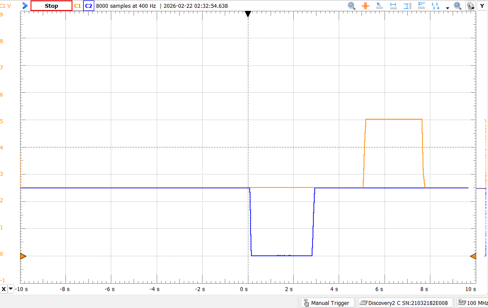

# Lab 5 Arduino II

The Lab 5 continues the introduction on Arduino basics, with emphasis on I/O.

Recall the pinout of **Adafruit ItsyBitsy M0 Express**,

https://github.com/adafruit/Adafruit-ItsyBitsy-M0-PCB/blob/master/Adafruit%20ItsyBitsy%20M0%20pinout.pdf 

* **Analog input**: All pins labeled with **AIN** can do analog input. We recommend use from **Pin A1** to **Pin A5**.
* **True analog output**: **Pin A0** is the only true analog output pin. It is labeled by **VOUT**
* **PWM output**: Most pins labeled with **D** can do PWM output. We recommend use from **Pin 9** to **Pin 13** 

---

## :dart: Task 1 – Joystick Analog Reading

### 📌 Task 1.1 Circuit Setup

Task 1 requires you to analyze the joystick analog readings using the Analog Discovery 2. This will prepare you for the Task 2 Arduino set-up.

**Components Used:**

* one KY-023 analog joystick
* one workbench with Analog Discovery 2
* No need for Arduino in Task 1
----------

The **VRX** and **VRY** pins output analog voltages for the X- and Y-axis positions.

 The **SW** pin is a digital push-button input. We won’t use it.

 Internally, **VRX** and **VRY** are driven by simple potentiometer-based voltage divider.

----------
**Connection Requirement:**

* Use `Supplies` (Pin V+) in Analog Discovery to provide 1 V DC to the joystick. 
* Use `Scope Channel 1` in Analog Discovery to measure the voltage (**VRX**) for X-position of the joystick. 
* Use `Scope Channel 2` in Analog Discovery to measure the voltage (**VRY**) for Y-position of the joystick. 
* Ensure all grounds are connected together, including:
   * both `Scope Channel` negative pins,
   * Analog Discovery Ground `↓`
   * joystick Ground

> [!NOTE]  
> You have completed multiple labs already. This time you are expected to handle the wiring **by yourself**.

> [!TIP]  
> If you have too many ground wires, organize them to the blue rail of your breadboard.

### 📌 Task 1.2 Scope Reading

In "Wavegen" -> "Supllies" to provide 1 V DC at the V+ pin.

Open your **Scope**, 
* Change the Mode from **Repeated** to **Screen**
* Use 2 s/div for Time Base
* Make sure both Channels are enabled.

Move the joystick in different directions, observe and understand the voltage.

* You may need to adjust the Channel Offset and Range to observe the full signal.
* You should set the same offset for 2 channels, same range to 2 channels, overwise may create confusion in reading.
---
Based on the joystick direction in the picture, measure and fill the table.

#### :pencil2:  Report Item 1-a

Always record experiment data in 3 or more significant digits (figures).

| Joystick Direction |  VRX Voltage   |  VRY Voltage   |
| :----------------- | :--------------------: | :--------------------: |
| Center             |         ≈ 500 mV        |         ≈ 500 mV        |
| Move Left          |  ?? mV|         ??  mV     |
| Move Rightmost          |  ?? mV|         ??  mV     |
| Move Upmost            |   ??   mV   | ?? mV|
| Move Downmost          |    ??  mV     | ?? mV|

#### :pencil2:  Report Item 1-b

Provide a screenshot of the display of your Scope with measurement on it. 
You don't need 8 screenshots for 8 measurements in 1-a, just one screenshot that matches one of the eight measurements.

---
### 📌 Task 1.3 Record 2-Channel Data

Record the scope voltages using regular Voltage-Time Scope and X-Y scope.

Follow such movement sequence:
1. Slowly move the joystick from center to the upmost position
2. Hold it there for 1 second
3. Slowly move it back to the center.
4. Slowly move the joystick from center to the rightmost position
5. Hold it there for 1 seconds
6. Slowly move it back to the center.

This is an example that you expect.

Then export as .csv for later use.

#### :pencil2:  Report Item 1-b

Provide the screenshot of the display of your Scope. Showing the full movement sequence.

> [!NOTE]
> Include the local time and device Serial Number (Discovery 2 C SN: ..) in the screenshot.
> Use computer-built-in app to screenshot. Not use your phone camera to take pictures.

----
### 📌 Task 1.4 Plot in Python (Individual)

**Clean-up Data:**

When exporting data in Screen Mode, the first recorded data row is often inaccurate due to buffer.

So, open your exported .csv, deleta the first data row.

#### :pencil2:  Report Item 1-c (Individual)
In Jupyter Notebook, use Python to re-plot the two signals from the Scope.

* Plots should have proper title, legend, x/y axis labels, units.

* Show both code and generated plot in the report.

---
### ✅ Check Point 1 — Scope Screenshot and Python Plot

