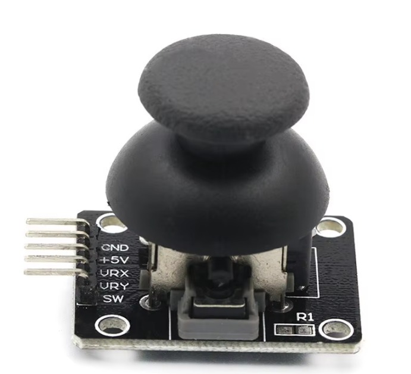
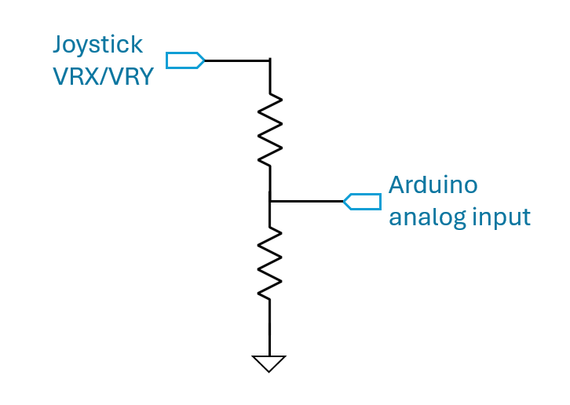

# Lab 5 Arduino II

## :dart: Task 2 – Joystick with Arduino

### 📌 Task 2.1 Circuit Setup

You have studied the characteristics of joystick analog reading. Now we will combine it with Arduino.

Get:

* one KY-023 analog joystick
* one Adafruit ItsyBitsy M0 Express



**Connection Requirement:**

* Use `VHI` in Arduino to provide 5 V DC to the joystick. 
* Use one Analog input pin to measure the voltage (**VRX**) for X-position of the joystick. 
* Use another Analog input pin to measure the voltage (**VRY**) for Y-position of the joystick. 
* Ensure Arduino `G` is connected to the joystick Ground

---
### 📌 Task 2.2 Arduino Code

Write Arduino Code to
* Read the voltages (**VRX**, **VRY**) from both analog input pins
* Print out both voltages via Serial Monitor

> [!TIP]
> You can re-visit the Lab 4 Main Task 3 code to understand how to obtain pin voltage and print.

#### :pencil2:  Report Item 2-a
Open the Serial Monitor. 

* Make sure your joystick is in **Center position**. Un-click “AutoScrolling”. Copy 10 consecutive output lines and paste them below.
```text
<paste your 10 lines here>
```
* Make sure your joystick is in **Rightmost position**. Un-click “AutoScrolling”. Copy 10 consecutive output lines and paste them below. 
```text
<paste your 10 lines here>
```

### 📌 Task 2.3 The 3.3 V Saturation Issue 

From your Task 1 measurement, you can see the actuall VRX/VRY Pin voltage is 5 V. 

But in Task 2.2, your Arduino only gives you 3.3 V print-out. 

This is a **3.3 V Saturation Issue** in Arduino:<br> Arduino’s ADC reference is 3.3 V. Any analog input above 3.3 V saturates and gets read as 3.3 V.

To measure higher voltages on an analog pin, you must place an intermediate circuit between the sensor and the Arduino. We commonly use a **Voltage Divider**.

----

Here is an example circuit.

If you use 2 identical resistors for a voltage divider, the output voltage will be half of the input voltage.

This means that even the max 5 V of VRX/VRY Pin, the divided output becomes 2.5 V, which stays within the Arduino’s 3.3 V ADC range.



---------
It is your job to build the extra voltage divider and modify the Arduino code. Such that you can get 5 V print-out when at Rightmost position.

#### :pencil2:  Report Item 2-b
Indicate your resistor values. (In case you forget which bin to return)


#### :pencil2:  Report Item 2-c
Provide the full Arduino code.

```c
your code
```


#### :pencil2:  Report Item 2-d
Open the Serial Monitor. 

* Make sure your joystick is in **Center position**. Un-click “AutoScrolling”. Copy 10 consecutive output lines and paste them below.
```text
<paste your 10 lines here>
```
* Make sure your joystick is in **Rightmost position**. Un-click “AutoScrolling”. Copy 10 consecutive output lines and paste them below. 
```text
<paste your 10 lines here>
```

### ✅ Check Point 2 — Arduino Print Voltage

- Return components to their proper bins.
- Place the blue workbench on the shelf in the correct order:  
  *(EECS 1–2, EECS 3–4, EECS 5–6, …)*  
