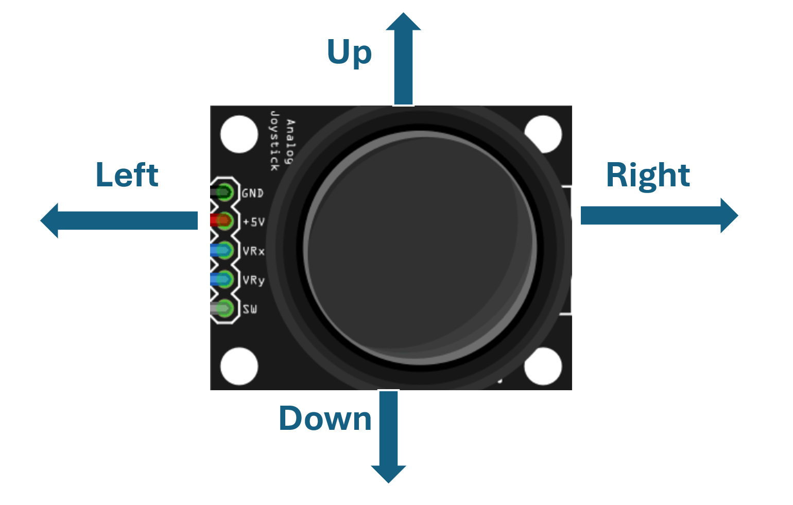

# Lab 5 Arduino II

## :dart: Task 2 – Transition from Analog Discovery to Arduino

### 📌 Task 2.1 The 3.3 V Saturation Issue

Lets say, if you want to use this joystick in an Arduino project. You will encounter a 3.3 V saturation issue.

From Task 1, you observed that the joystick output voltage can vary from 0 V up to 5 V. However, many modern microcontroller boards (including our ItsyBitsy M0 Express) operate at **3.3 V logic**. The 5 V voltage level is beyond their reading limit.

In simpler words, these boards can only read voltages up to 3.3 V.

*If you are curious why from 5 V to 3.3 V logic, you can read this: https://www.reddit.com/r/arduino/comments/xhvn3k/5v_vs_33v_whats_the_reason_were_seeing_more_33v/*

To resolve this issue, we can modify the input side of the system to reduce the voltage level before it reaches the Arduino pin.

--------

In our lab case, a simple solution could be to change the joystick’s supply voltage (VCC). 

**Instead of powering the joystick with 5 V, we power it with 3.3 V.** Since the joystick is essentially a potentiometer, its output voltage will now scale proportionally from 0 V to 3.3 V.

Now, let's use experiments to verify whether this works?

Keep the exact same wiring and settings from Task 1. The only thing to change is reducing 5 V DC in Wavgen to 3.3 V DC.

Move your joystick around, measure and fill the table.

#### :pencil2:  Report Item 2-a

| Joystick Direction |  VRX Voltage (X-axis)  |  VRY Voltage (Y-axis)  |
| :----------------- | :--------------------: | :--------------------: |
| Center             |         ?? V        |         ?? V        |
| Move Rightmost          |  ?? V|         ??  V     |
| Move Upmost            |   ??   V   | ?? V|
| Move Downmost          |    ??  V     | ?? V|

