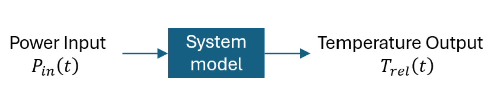

# Lab 6 Thermal System

## :dart: Task 1 –Setup


In Lab6, we will study a **first order thermal system**.

Specifically, we will focus the **step response** of this system.

We will also continue to practice the usage of Analog Discovery and Arduino.

----
The system can be modeled as such:



* **System Input:** the power $P_{in}(t)$ (Unit: Watt) delivered to the resistor. <br>It is set to be a **step input**: $Au(t)$
* **System Output:** relative temperature $T_{rel}(t)$ (unit: °C) of the resistor. <br>It is the difference
between the heated temperature readed by the sensing chip $T_{chip}(t)$, and the room temperature $T_{room}$<br>$T_{rel}(t)=T_{chip}(t)-T_{room}(t)$

First order system **Transfer Function**:

$$\frac{T_{rel}(t)}{P_{in}(t)}=\frac{b}{s+a}$$

$A$, $a$, $b$, $T_{room}$ are unknown constants.

If we apply inverse Laplace, we can derive its **Time-Domain Response** as:

$$T_{rel}(t)=\frac{bA}{a}(1-e^{-at})$$

$$T_{chip}(t)=\frac{bA}{a}(1-e^{-at})+T_{room}$$

Since $A$, $a$, $b$ are unknow constants, we can simply the writting as:

$$T_{rel}(t) = T_{ss}\left(1 - e^{-t/\tau}\right)+T_{room}$$

* $T_{ss} = \dfrac{bA}{a}$ is the **steady-state temperature rise** above room temperature,
* $\tau = \dfrac{1}{a}$ is the **Time Constant**.

---
### 📌 Task 1.1 Pre Setup
> [!IMPORTANT]  
> you must do this first.

Many Arduino has previously uploaded code. We never know who uploaded what code on
it.

Connect USB to Arduino without any jump wires. 

Run this code first to reset the commonly used PWM pins.

After completion, unplug the USB.

```c
// This code resets PWM pins 7,9,10,11,12 to 0 duty cycle
void setup() {
analogWrite(12, 0);
analogWrite(11, 0);
analogWrite(10, 0);
analogWrite(9, 0);
analogWrite(7, 0);
}
void loop() {
}
```

### 📌 Task 1.2 Actual System Introduction

The actual system is this board named "Temperature Control":


* The green resistor is the load to be heated.
* The chip under the green resistor is a temperature sensor.
* The half-cylinder item is a 2N7000 MOSFET and acts as a logic switch. The MOSFET
will be fully turned on if a gate signal is above 3 V.

	In this lab, we use a 3.3 V PWM signal as the gate signal to turn on MOSFET.
So the switch will be on when PWM signal is High, will be off when PWM is Zero.
* The +5 V DC is the voltage of the main circuit loop.


### 📌 Task 1.3 Wiring Explained

Overall, the board can be simply considered as such connection:


▪ The **+5 V DC** is drawn from the **Pin Vhi** of the ItsyBitsy M0 Express.
 <br>This 5 V DC supplies power to heat up the resistor.

▪ The **PWM signal** is controlled by the **PWM pin** of the Arduino.
 <br>It adjusts the heat-power input to the heated resistor.

▪ The resistor’s temperature is measured by a chip underneath it.
 <br>The chip outputs a voltage to the **Temp Pin**, following the equation:

$$\mathrm{Temperature (°C)} = \dfrac{\mathrm{V (volts)}}{0.100}$$

For example, if the temperature is 23 °C, the chip outputs 2.3 V.
Use the **Analog Discovery** to measure this sensor voltage.

**Pin Connection:**

| **The Borad**        | **Analog Discovery** | **Arduino** |
| :-----------------| :------------------- | :---------- |
| +5V DC         | —                    | Pin Vhi          |
| Temp         | Pin 1+               | —           |
| PWM               | —                    | PWM Pin ?   |
| Gnd                    | Pin ↓, Pin 1-       | Pin G       |

PWM Pin ? can be selected from any pin you reset in the Task 1.1 code.

> [!TIP]
> If you have too many ground wires, organize them to the blue rail of your breadboard.


