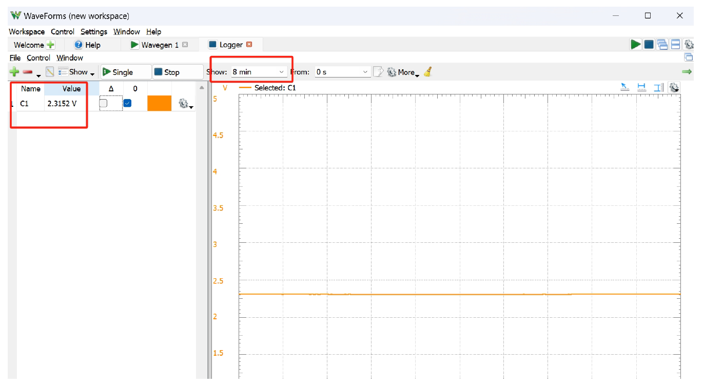

# Lab 6 Thermal System

## :dart: Task 2 Heat using Full Power

In the prelab, you studied the relationship between Power and Duty Cycle. In fact, they are
**proportional** !
In this task, we will test the heating power using Full Power, in other words, PWM
Duty Cycle is 100%

----
### 📌 Task 2.1 Configuration

Wire everyhing up. 

Re-run the Arduino code given in the Pre Setup.

In Analog Discovery, open **Logger**.  This is a new tool to you. It is mainly used to record
signals in very long time period.

Make sure only “**C1**” Channel is selected. It corresponds to the TEMP readings from the
board sensor.

Adjust the “**Show**” time to be large. We recommend 10-15 minutes.

Run the Logger, make sure that you can see a flat line. The voltage reading should be
reasonable value that corresponds to the room temperature:

$$\mathrm{Temperature (°C)} = \dfrac{\mathrm{V (volts)}}{0.100}$$
