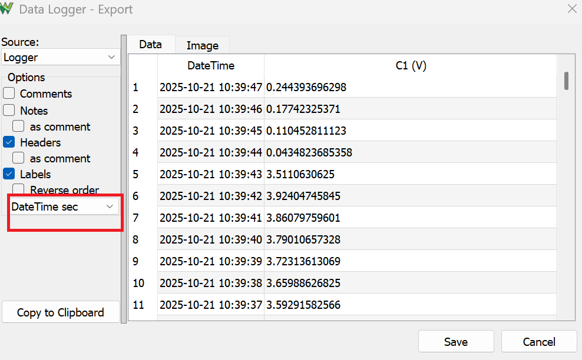

# Lab 6 Thermal System

## :dart: Task 2 Heat using Full Power

In the prelab, you studied the relationship between Power and Duty Cycle. In fact, they are
**proportional** !
In this task, we will test the heating power using Full Power, in other words, PWM
Duty Cycle is 100%

----
### 📌 Task 2.1 Configuration

Wire everyhing up. 

Re-run the Arduino code given in the Pre Setup.

In Analog Discovery, open **Logger**. <br>This is a new tool to you. It is mainly used to record
signals in very long time period.


Make sure only “**C1**” Channel is selected. It corresponds to the TEMP readings from the
board sensor.

Adjust the “**Show**” time to be large. We recommend 10-15 minutes.

Run the Logger, make sure that you can see a flat line. The voltage reading should be
reasonable value that corresponds to the room temperature:

$$\mathrm{Temperature (°C)} = \dfrac{\mathrm{V (volts)}}{0.100}$$

----
### 📌 Task 2.2 Heat and Log

**Keep the Logger running. Don’t stop it.**

Now, go to Arduino IDE, adjust the value in ```analogWrite(PWMPin, 255)```. 
* ```PWMPin``` is the PWM Pin number that you are connecting to. 
* ```255``` makes the PWM signal to be 100% Duty Cycle (fully HIGH).

Upload the Arduino code. Patiently wait for the response on Logger.

On the logger, you should observe the signal gradually increasing in an exponential manner, eventually reaching a steady state.

| **This is an example plot I got. Make sure your plot show both initial state and steady state** | 
|---------------------|
|  | 

#### :pencil2:  Report Item 2-a

Provide the screenshot of your Logger showing the heating process. Make sure your plot show both initial state and steady state.

> [!NOTE]
> Include the device Serial Number (Discovery 2 C SN: ..) in the screenshot.
> Use computer-built-in app to screenshot. Not use your phone camera to take pictures.

#### :pencil2:  Report Item 2-b

Save the Logger display to .csv. 

Note: Change the "**Relative Time**" to "**DateTime sec**" when exporting.

 

### 📌 Task 2.3 Data Visualization (Individual)

In this task, you will use Python to plot the saved .csv file.

**Clean-up Data:**

For Logger .csv, a few buffer rows may appear at the end.

Open your exported .csv, scroll to the bottom, and check whether the DateTime suddenly jumps (out of order). If it does, delete those rows.

**Pandas Timestamp:**

In Python Pandas, the function [`pandas.to_datetime()`](https://pandas.pydata.org/docs/reference/api/pandas.to_datetime.html) can parse and handle **datetime strings** such as `2025-10-21 10:30:25`, for time-based analysis.

```python
# After read_csv, suppose my DataFrame object is named as cao_lab6_data  
cao_lab6_data["DateTime"] = pd.to_datetime(cao_lab6_data["DateTime"])
cao_lab6_data["t_sec"] = (cao_lab6_data["DateTime"] - cao_lab6_data["DateTime"].min()).dt.total_seconds()
print(cao_lab6_data)
```
