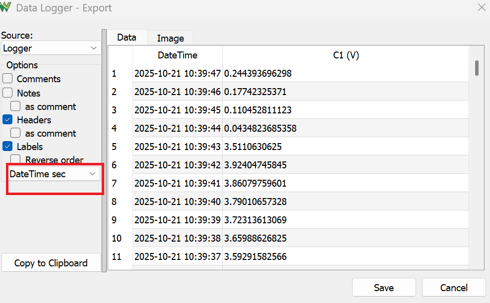

# Lab 6 Thermal System

## :dart: Task 3 Heat using Half Power

Once your resistor is fully cooled down (been cooled down for at least 10 minutes), you can start this Task.

Task 3 will basically repeat the same procedures as in Task 2, except it will use a different PWM signal.

### 📌 Task 3.1 Configuration

Connect back the USB to Arduino, but keep all jumpwires to Arduino disconnected.

Re-run the Arduino code given in the Task 1.1 Pre Setup to reset all PWM pins.

Then connect back all jumpwires to Arduino.

Once done, continue to run Analog Discovery **Logger**. Click the broom symbol  to erase previous log. Then let it log the room temperature for 1 minute.

----
### 📌 Task 2.2 Heat and Log

**Keep the Logger running. Don’t stop it.**

Next, go to Arduino IDE, adjust the value in ```analogWrite(PWMPin, 127)```. 
* ```PWMPin``` is the PWM Pin number that you are connecting to. 
* ```127``` makes the PWM signal to be 50% Duty Cycle (half HIGH).

Upload the Arduino code. Patiently wait for the response on Logger.

On the logger, you should observe the signal gradually increasing in an exponential manner, eventually reaching a steady state.

#### :pencil2:  Report Item 2-a

Provide the screenshot of your Logger showing the heating process. Make sure your plot show both initial state and steady state.

> [!NOTE]
> Include the device Serial Number (Discovery 2 C SN: ..) in the screenshot.
> Use computer-built-in app to screenshot. Not use your phone camera to take pictures.

-------
Then, save the Logger display to .csv. 

Note: Change the "**Relative Time**" to "**DateTime sec**" when exporting.

 

### 📌 Task 2.3 Data Visualization (Individual)

In this task, you will use Python to plot the saved .csv file.

#### :pencil2:  Report Item 2-b (Individual)

In Jupyter Notebook, use Python to plot temperature of the system:
* Plot Time (seconds) as X-axis
* Plot Temperature (degree C) as Y-axis


> [!NOTE]
> The column names in the `.csv` file are different from the previous labs. You can open the `.csv` to inspect.
>
> The temperature–voltage relationship was provided earlier.


---
### ✅ Check Point 2 — Logger Screenshot and Python Plot

