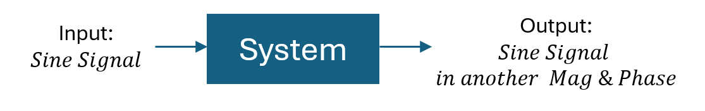
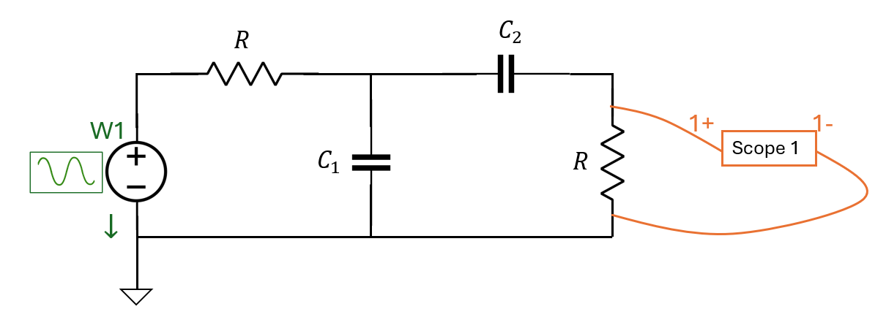
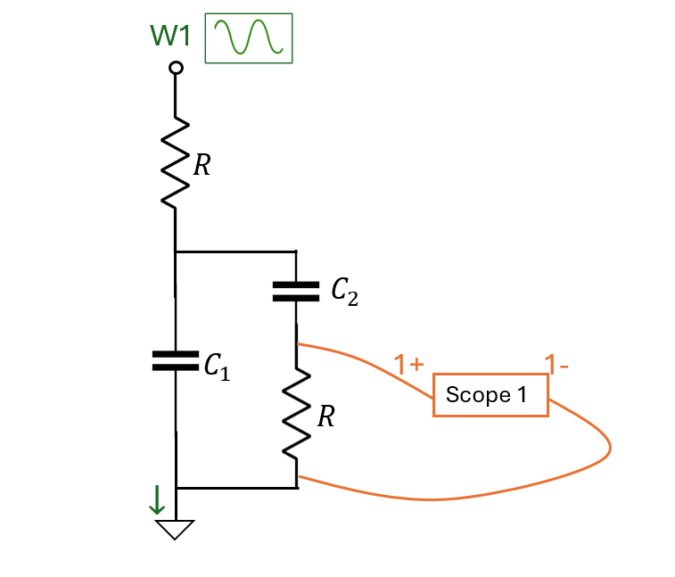
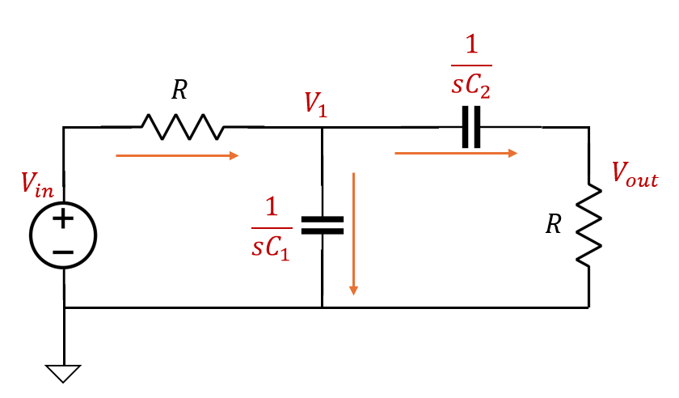

# Lab 7 Sine & Bode

## :dart: Task 1 –Setup

In Lab 7, we will study the **sinusoidal response** of a **second order system.**

We will use a RC circuit as a second order system.

 

---
### 📌 Task 1.1 Circuit Setup

| **Circuit Diagram** | **Schematic Syle (Equivalent)** |
|---------------------|------------------------------|
|  |  |

**Components Used:**
- Both resistors $R = 33~\mathrm{k}\Omega$, (color code: orange orange orange gold)
- $C_1 = 220~\mathrm{nF}$ capacitor
- $C_2 = 22~\mathrm{nF}$ capacitor
- W1 will be configure to Sine signal in Wavengen later.
  
> [!TIP]
> If you have too many ground wires, organize them to the blue rail of your breadboard.

---
### 📌 Task 1.2 System Transfer Function

 

We can analyze the system transfer function using impedance and Nodal Analysis.

- The impedance of $C_1$ is $1/sC_1$
- The impedance of $C_2$ is $1/sC_2$

Nodal Analysis applied to Noda $V_1$:

$$\frac{V_{in}-V_1}{R}=\frac{V_1}{1/sC_1}+\frac{V_1}{1/sC_2+R}$$

$$\left(\frac{1}{R}+sC_1+\frac{sC_2}{1+sRC_2} \right)V_1=\frac{1}{R}V_{in}$$

Analyze the branch only with $C_2$ and $R$:

$$\frac{V_{out}}{V_{1}}=\frac{R}{R+1/sC_2}=\frac{sRC_2}{1+sRC_2}$$

$$V_{1}=\frac{1+sRC_2}{sRC_2}V_{out}$$

Combine these 2 analyzed equations and substitute $V_1$:

$$\left(\frac{1}{R}+sC_1+\frac{sC_2}{1+sRC_2} \right)\frac{1+sRC_2}{sRC_2}V_{out}=\frac{1}{R}V_{in}$$

$$\frac{R^2C_1C_2s^2+R(C_1+2C_2)+1}{RC_2s}V_{out}=V_{in}$$

Thus, the system Transfer Function will be

$$H(s)=\frac{V_{out}}{V_{in}}=\frac{RC_2s}{R^2C_1C_2s^2 + R(C_1+2C_2)s + 1}$$

#### :pencil2:  Report Item 1-a

In Python, enter all component values.  Then use `scipy.signal.lti` or `scipy.signal.TransferFunction` to create the system model.  Finally print out the system model.

> [!TIP]
> Regarding to power term typing in Python
> 
> $5\times10^3$ can be typed as `5E3` in Python. $5\times10^{-3}$ can be typed as `5E-3` in Python. 

---------

### ✅ Proceed to Task 2. No Check Point in this part.

