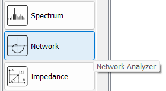
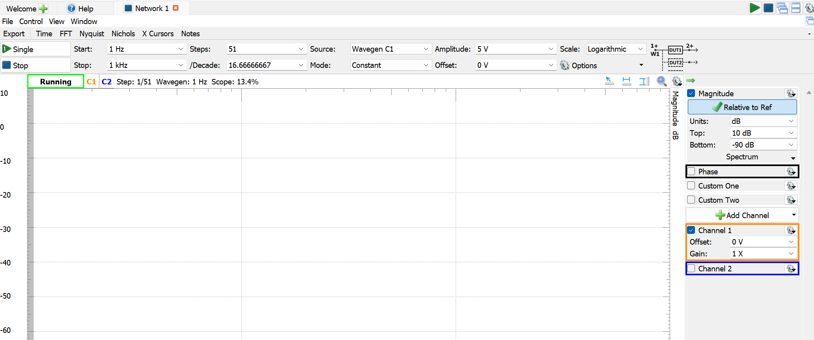

# Lab 7 Sine & Bode

## :dart: Task 3 – Auto Obtain Bode

In this task, we will use the **[Network Analyzer](https://en.wikipedia.org/wiki/Network_analyzer_(electrical))** tool to automatically obtain a Bode magnitude plot for the circuit system.

The WaveForms of Analog Discovery includes a network analyzer tool.   To open it, click the **Network** icon on the welcome page.

------

### 📌 Task 3.1 Frequency Sweep

Configure your Network Analyze as such:

**Top Panel**:
* Start: 1 Hz; Stop 1 kHz
* Steps: 51 or more
* Source: Wavegen C1; Mode: Constant
* Amplitude: 5 V; Offset: 0 V
* Scale: Logarithmic

**Right Panel**:
* Magnitude only
* Channel 1 only
* Others as default  

