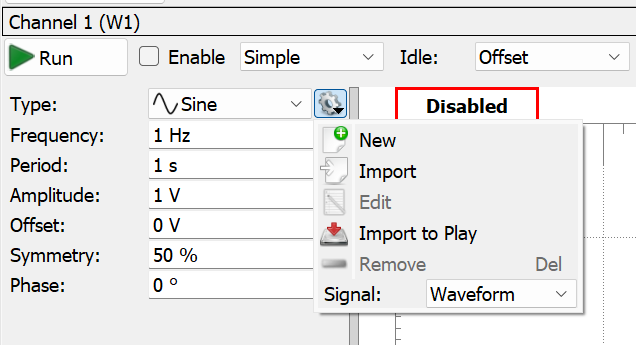
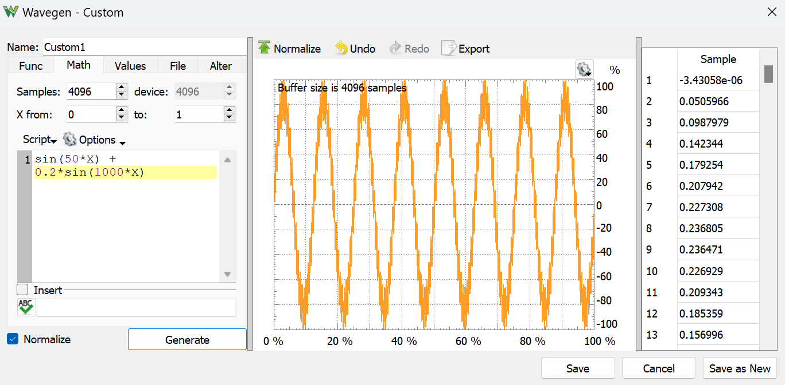

# ELE 292 Lab 7: Filters
## Task 1 – Set Input with Noise

---

### Overview
In Electrical Engineering, filters are used to selectively pass or attenuate specific frequency components of a signal. A common application of filters is dealing with signals affected by
low-frequency or high-frequency noise. 

In the task, we will use Analog Discovery 2’s Wavegen and Scope to create and analyze signals with high-frequency noise.

**Connection**: Directly connect Wavegen to Scope.


---

### 1.1 Create a Signal with High-Freq Noise

**Wavegen Setup**:
- Type: `Sine`
- Frequency: `1 Hz`
- Amplitude: `1 V`
- Offset: `0`
- Symmetry: `50%`

Then click the **gear icon → New** and configure the math expression as:

```javascript
sin(50*X) + 0.2*sin(1000*X)
```





- The **main signal**: `sin(50x)`
- The **noise signal**: `0.2 sin(1000x)`

Click **Generate**, then **Save**, and finally **Run** the Wavegen.

---

### Frequency Analysis with FFT

**Scope Setup**:
- Y-axis: Fit the signal to ~50% of the display window
- X-axis: Fit around 10 cycles in the display window

---
Use the **FFT** tool in Scope:

- Start: `0 Hz`, Stop: `500 Hz` *(adjustable)*
- Top: `20 dB`, Bottom: `-40 dB`
- Type: `Sample`, Window: `Flat Top`
- Units: `Peak (dB)`, Reference: `1 V`

> Any peak below -40 dB can be ignored (`20 log(0.01) = -40 dB`)

Use **cursors** to measure the frequency and magnitude of the peaks.

**Example Calculations**:
- **Primary peak**:
  - Frequency: `7.80 Hz → 49 rad/s`
  - Magnitude: `0 dB → 1 V`
  - Term: `1 × sin(49x)`
- **Secondary peak**:
  - Frequency: `190 Hz → 1193.8 rad/s`
  - Magnitude: `-15 dB → 0.178 V`
  - Term: `0.178 × sin(1193.8x)`

---

### :pencil: Report Item 1-a

| Peak Type       | Frequency (Hz) | Magnitude (dB) |
|------------------|----------------|----------------|
| Primary Peak     |                |                |
| Secondary Peak   |                |                |

---

### :pencil: Report Item 1-b (Individual Work)

- Derive the estimated math expression from your FFT result.
- Is it close to the theoretical `sin(50x) + 0.2 sin(1000x)`?

## :white_check_mark: **Check Point 1**

---
