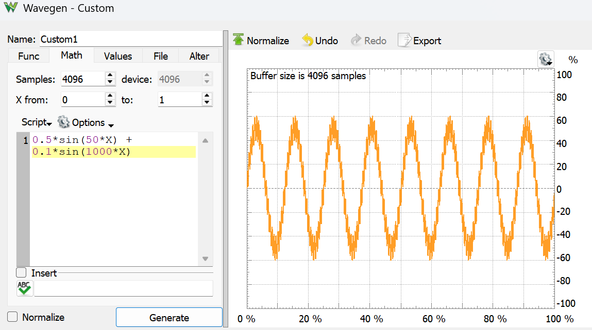

# Lab 8 Filter Design

## :dart: Task 1 – Noisy Input

In Electrical Engineering, filters are used to selectively pass or attenuate specific frequency components of a signal. 

A common application of filters is dealing with signals affected by low-frequency or high-frequency noise. 

We will use Analog Discovery 2 to create signals with low frequency noise.

---
### 📌 Task 1.1 Wavegen Setup
Connect Analog Discovery 2 with your computer.

Open up **Wavegen.**

In Signal Type, click the gearbox to add a new customized signal:

```java
0.5*sin(50*X) + 0.1*sin(1000*X)
```

Untick ``Normalize``

Then click ``Generate``, Once you observe such graph, click `save`.



Then go back to the main page of Wavegen, set as follows.

| Setting   | Value              |
| --------- | ------------------ |
| Type      | Your custom signal |
| Frequency | 1 Hz               |
| Amplitude | 2 V                |
| Offset    | 0 V                |
| Symmetry  | 50 %               |


By doing so, you set up such signal:

$$x(t) = \sin(50t)+0.2\sin(1000t)$$

* The $\sin(50t)$ is the main signal
* The $0.2\sin(1000t)$ is the noise

### 📌 Task 1.2 Observe the Signal via Scope

Now, use the Analog Discovery's Scope to directly observe the Wavegen Signal.

For reference, **Pin Connection:**

|         | **Analog Discovery** | **Analog Discovery** |
| :-----------------| :------------------- | :---------- |
| Jumpwire 1        | W1                    | Pin 1+         |
| Jumpwire 2         | Pin 1-               | Pin ↓          |

Run both Wavegen and Scope,

Adjust your Scope to:
* display about 8~15 cycles
* clearly show the amplitude

#### :pencil2:  Report Item 1-a

Provide the screenshot of your Scope. Include time and device Serial Number.

---
### ✅ Keep running and unchanged. Proceed to Task 2. No Check Point here.


