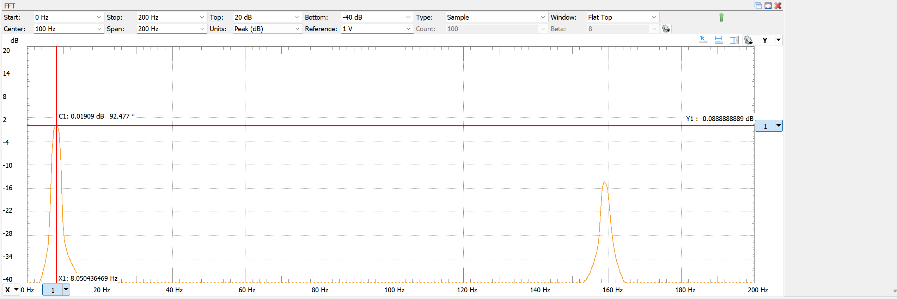

# Lab 8 Filter Design

## :dart: Task 2 – Understand FFT

Keep the previous setting in Task 1.

---
### 📌 Task 2.1 FFT Tool
**“FFT”** (Fast Fourier Transform) is a tool to identify the freq-based compositions of a complex
signal.

On the top bar of the Scope, click `FFT` and set it as:

* Start: 0 Hz; Stop 500 Hz (or smaller)
* Top: 20 dB; Bottom -40 dB
* Type: Sample; Window: Flat Top
* Units: Peak (dB); Reference: 1 V

Now, in the FFT display, you should see 2 significant peaks.

* The highest peak corresponds to the main signal $sin(50t)$,
* The 2nd highest peak corresponds to the noise part $0.2 \sin(1000t)$.

Any peak below -40 dB can be ignored, as $20 log_{10} 0.01 = −40 \mathrm{dB}$, 0.01 is a
small enough ratio. This is why Buttom is -40 dB setup.

Now, you will use the X and Y cursors on the FFT window to measure these 2 significant peaks.

#### :pencil2:  Report Item 2-a

Provide the screenshot of your FFT. Include device Serial Number.

#### :pencil2:  Report Item 2-b
Fill the table based on the FFT measurement.

* **Freq (Hz)** is obtained by X-cursor on FFT
* **Mag (dB)** is obtained by X-cursor on FFT
* **Signal Amplitude (V)** is obtained by calculating **Mag (dB)** as:
  
  $$\mathrm{Amplitude\ (V)} = 1\times 10^{\frac{\text{Mag\ (dB)}}{20}} \ \text{\ V} \quad \text{(since Reference = 1 V)}$$

|    | Freq (Hz) | Mag (dB)| Signal Amplitude (V)|
| --------- | ----- |----- |----- |
| highest peak |      |      |----- |
| 2nd highest peak |     |      |----- |
