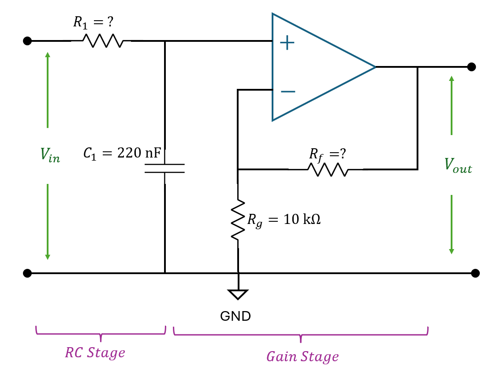
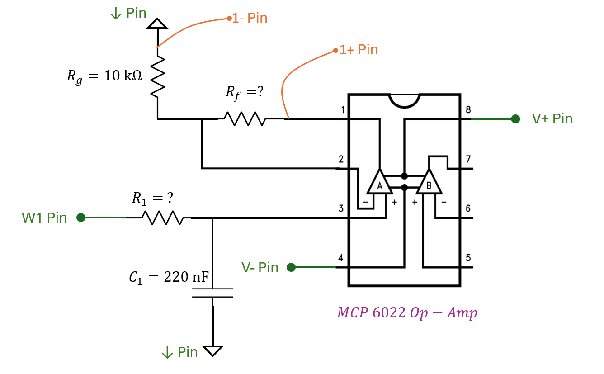

# Lab 8 Filter Design

## :dart: Task 3 – Active Low-pass Filter

Keep the Wavegen input from previous tasks.

For the previous input signal, we can apply a filter to make it less noisy. 

From a linear system view, this means passing the **input** $x(t) = \sin(50t) + 0.2\sin(1000t)$ through a **filter system**,  so that the main signal amplitude **in output** remains nearly unchanged, while the noise part **in output** gets attenuated.

In the filter design process, we select a **cutoff frequency** that lies between the two frequency components of the signal

* $f_{\text{cutoff}}\ (\text{Hz}) > 50/(2\pi) \approx 7.96~\text{Hz}$
* $f_{\text{cutoff}}\ (\text{Hz}) < 1000/(2\pi) \approx 159.15~\text{Hz}$

A practical choice for $f_{\text{cutoff}}$ will be around 15–30 Hz, nearly a decade left from 159.15 Hz.

---
### 📌 Task 3.1 Filter Design Requirements

In Task 3, you need to design a filter that satisfies both requirements:

**Requirement 1.** cutoff frequency $f_{\text{cutoff}}$ will be around 15–30 Hz 
**Requirement 2.** DC Gain, $H(0)$, to be 2.

---
### 📌 Task 3.2 Select Resistors

For circuit, we will build an **active low-pass filter** consists of two main stages:

* **RC Stage:** Use an **RC network** ($R_1, C_1$) to set the desired cutoff frequency
* **Gain Stage:** Use an **Op-Amp network** to set the desired DC Gain

* $R_1 = ?? \mathrm{k}\Omega$, (your job)
* $C_1 = 220 \mathrm{nF}$
* feeback resistor $R_f = ?? \mathrm{k}\Omega$, (your job)
* ground resistor $R_g = 10 \mathrm{k}\Omega$
  
The Transfer Function of this entire circuit is:

$$H(s) = \frac{V_{\text{out}}(s)}{V_{\text{in}}(s)}= \frac{1/(R_1C_1)}{s + 1/(R_1C_1)}\cdot (1 + \dfrac{R_f}{R_g})$$

Based on the Transfer Function, we can analyze:
1. cutoff frequency:

$$f_{\text{cutoff}}\ (\text{Hz}) = 1/(2\pi R_1 C_1)$$

2. DC Gain:

$$|H(0)|=\frac{1/(R_1C_1)}{0 + 1/(R_1C_1)}\cdot (1 + \dfrac{R_f}{R_g})=1 + \dfrac{R_f}{R_g}$$

#### :pencil2:  Report Item 3-a

Based on the design requirements stated in Task 3.1 and the resistor availability in the lab bins, select appropriate resistors.
* $R_1 = ?? \mathrm{k}\Omega$
* feeback resistor $R_f = ?? \mathrm{k}\Omega$

---
### 📌 Task 3.3 Circuit Setup

We select **MCP6022** as the Op-Amp. You can find its datasheet online at: [MCP6022 Datasheet (TI)](https://www.ti.com/lit/ds/symlink/lmc6022.pdf?ts=1762179741020)

| **Filter Schematic** |
|------------------------------|
|orange and green are pins from Analog Discovery 2.|
|when placing Op-Amp, use the small notch (half circle) to identify its up-down side.|
|  |

> [!TIP]
> To keep your circuit layout neat and easy to debug, we suggest you:
> 
> * Place $R_f$ and $R_g$ together in another section of the breadboard.
> * Place $R_1$ and $C_1$ together in one section of the breadboard.

> [!TIP]
> If you have too many ground wires, organize them to the blue rail of your breadboard.

---
### 📌 Task 3.4 Obtain the Output

After wiring up, go to your **WaveForms**
* Keep the previous Wavegen running
* Open **Supplies** on the Welcome Page.
  * Set `V+` to be 5 V; 
  * Set `V-` to be -5 V.
  * Then Run the Supplies.
* Open and Run Scope. Adjust your signal display

---
In your Scope, you should see that the signal becomes much less noisy. And the max amplitude is around 2 V. That indicates your filter is working.

#### :pencil2:  Report Item 3-b

Provide the screenshot of your Scope. Include time and device Serial Number.

---
### 📌 Task 3.5 FFT Analysis for the Output

Next, use the same FFT tool setting introduced in Task 2. Obtain the FFT measurement again. 

#### :pencil2:  Report Item 3-c

Provide the screenshot of your FFT. Include device Serial Number.

#### :pencil2:  Report Item 3-d
|    | Freq (Hz) | Mag (dB)| Signal Amplitude (V)|
| --------- | ----- |----- |----- |
| highest peak |  $f_1=??$    |  $Mag_1=??$    |$A_1=??$ |
| 2nd highest peak |  $f_2=??$   |    $Mag_2=??$  |$A_2=??$|

#### :pencil2: Report Item 3-e (Individual)

Use the frequency and amplitude values you found in **Table 3-d** to write down the **mathematical expression** of the measured output signal:

$$V_{out}(t) = A_1 \sin(2\pi f_1 t) + A_2 \sin(2\pi f_2 t)$$

### ✅ Check Point 2 — Scope Display, FFT Display

