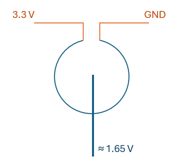
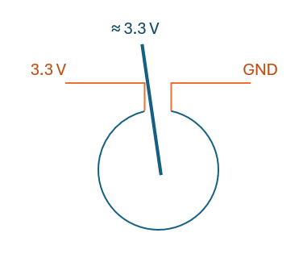
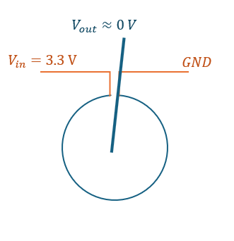

# Lab 9 Pendulum I

## :dart: Task 1 – Set up the Pendulum

---
### 📌 Task 1.1 Place the pendulum
Take a pendulum and set it on the workbench.

Fix the pendulum to the blue surface using two nuts and bolts. Ensure that, when the
pendulum swings, it has enough space and won’t collide with anything.

You can use hand or this tool to tighten the nuts.

You need to dis-assemble it at the end of class. So don’t tighten it very very firmly.

|  |  |
|---------------------|------------------------------|
|  |  |

---
### 📌 Task 1.2 Connect the pendulum

The pendulum is equipped with a rotary potentiometer (Pot). This rotary potentiometer
can act as an angle sensor.

We mainly connect the pendulum system to the ItsyBitsy M0 Express. Also, Analog Discovery is added for extra debugging.

| **Pendulum**            | **ItsyBitsy M0 Express (Arduino)**      | **Analog Discovery** |
| :---------------------- | :-------------------------------------- | :------------------- |
| Red wire ($V_{in}$)     | 3V Pin (provides 3.3 V DC)          | --                   |
| Yellow wire ($V_{out}$) | any Analog input pin  | Pin 1+      |
| Black wire ($GND$)      | Pin G                             |Pin 1-,  Pin ↓      |

*Note:*  For Analog input pin, you can review [Lab 4 Main Task 1 (Arduino I)](../Lab%204%20Arduino%20I/Lab%204%20Main%20Task%201.md)

---
### 📌 Task 1.3 Test the pendulum

As you learned in prelab, the Pot is:

$$V_{out} = \frac{Rotation Deg}{360} \times V_{in}$$

So if you place pendulum in the following positions, you should get such $V_{out}$:
| downward center: $V_{out}\approx 1.65 \text{V}$ | upward to one side: $V_{out}\approx 3.3 \text{V}$ |  upward to the other side: $V_{out}\approx 0 \text{V}$ |
|---------------------|---------------------|---------------------|
|  |  |  |

Now, we will use both Arduino and Analog Discovery to measure and verify such $V_{out}$.

* For Arduino, write a simple code the can print out the real time voltage from your assigned Analog pin to
Serial Monitor.   You can review [Lab 4 Main Task 3 (Arduino I)](../Lab%204%20Arduino%20I/Lab%204%20Main%20Task%203.md) for code piece.
* For Analog Discovery, you can use either `Scope` or `Voltmeter` to measure it.

**Slowly move the pendulum in a full circle** and observe the measurements from both the Arduino Serial Monitor and the Analog Discovery.

You should see that the readings gradually change from 0 V to 3.3 V as you complete a full circle.

#### :pencil2:  Report Item 1-a

| **Rotation**                      | **Theoretical $V_{out}$** | **Arduino Serial Monitor** | **Analog Discovery** |
|:------------:|:--------------:|:--------:|:--------:|
| 180° |               1.65 V                 |                            |                      |

---
### ✅ Keep running and unchanged. Proceed to Task 2. No Check Point here.

