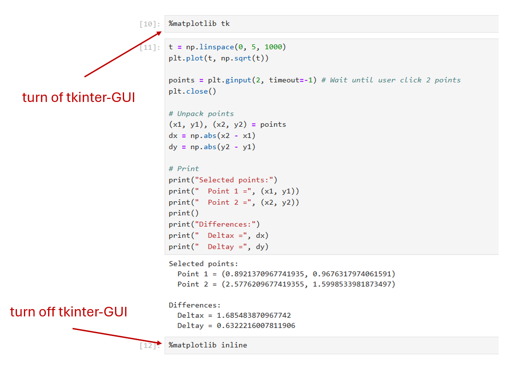

# Lab 9 Pendulum I

## :dart: Task 3 – Matplotlib Interactive Measurement

--------

From the previous Report Item, you should obtain a plot in shape as the impulse response of a second-order system.

The next task is to measure the following quantities on the plot:

|**$\Delta T$** is time difference (second), **$\Delta \theta$** is angle difference (Deg) | 
|---------------------|
|  | 

-----
To measure these quantities directly on your plot, you can use `matplotlib.pyplot.ginput` tool and `tkinter` GUI.

To do so:
Suppose you already imported matplotlib in Jupyter Notebook.
- Step 1: start a new code cell. Run this single code line only:
```python
%matplotlib tk
```

  This will activate the tkinter-GUI for plotting.
- Step 2: start another new code cell, code your plot using `matplotlib.pyplot.ginput` . such as:
```python
plt.plot(your_x_data???, your_y_data???) # plot your data

points = plt.ginput(2, timeout=-1) # Wait until user click 2 points
plt.close()

# Unpack points
(x1, y1), (x2, y2) = points
dx = np.abs(x2 - x1)
dy = np.abs(y2 - y1)

# Print
print("Selected points:")
print("  Point 1 =", (x1, y1))
print("  Point 2 =", (x2, y2))
print()
print("Differences:")
print("  Deltax =", dx)
print("  Deltay =", dy)

```  
  
Run this code cell, you can see a pop-out window. Then you can click and measure.
- Step 3: once measurement finished, you need to start another new code cell.
Run this single code line only:
```python
%matplotlib inline
```
  This will turn off tkinter-GUI and switch back to normal.


|This is a picture of example procedure. | 
|---------------------|
|  | 

> [!NOTE]
> If your exported data contains a long steady-state region where the angle remains 0 Deg,  
> you can slice the data array.

For example:
```python
# Keep only a slice of the data (such as from index 500 to 8000)
time_data = lab9_data['Time']
voltage_data = lab9_data['Voltage']
time_data_slice = time_data[500:8000]
voltage_data_slice = voltage_data[500:8000]
```


