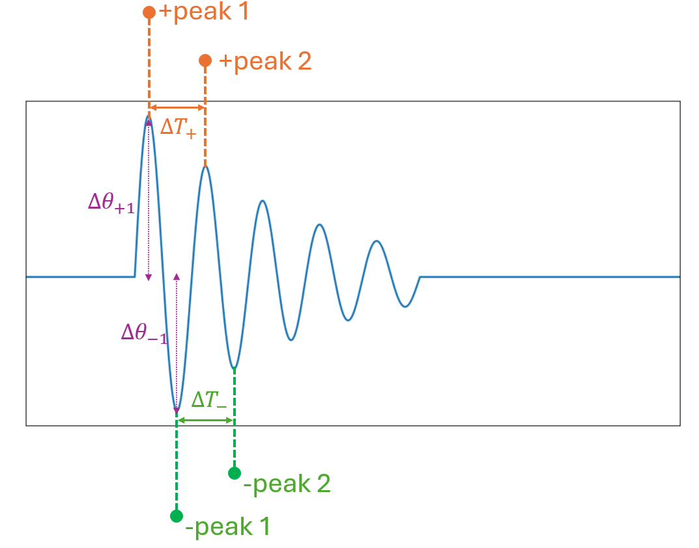

# Lab 9 Pendulum I

## :dart: Task 3 – Matplotlib Interactive Measurement

--------

From the last Report Item, you will get a plot in the shape of impulse response of second order system.

The next task is to measure the following 

Now, We would like to measure the peaks in your Matplotlib plot.

