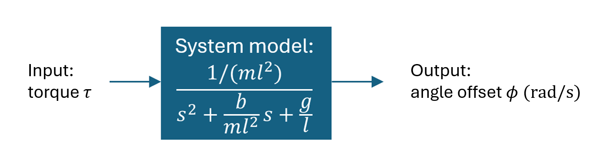

# Lab 9 Pendulum I

## :dart: Task 4 – System Analysis

--------
### 📌 Task 4.1 Understand the System
The pendulum can be approximately considered as a **second order system**. 

The tap action can be considered as an **impulse input** .

Where,
- $m = 0.038 \mathrm{kg}$ is the mass.
- $g = 9.81 \mathrm{m/s^2}$ is the gravitational constant
- $\phi$ (unit: rad) is the pendulum offset angle.
> **Note:** When discussing transfer functions, angular quantities are always expressed in radians (rad), not degrees. Their conversion is:

$$\phi_{\text{rad}} = \theta_{\text{deg}} \times \frac{\pi}{180}$$

We also assume two are unknown,
- $l$: unknown pendulum length
- $b$: unknown friction parameter
- 
---
Compare the denominator of pendulum system model:

$$\frac{...}{s^2+\frac{b}{m\cdot l^2}s+\frac{g}{l}}$$

Versus the standard 2nd order transfer function:

$$\frac{...}{s^2+2\zeta\omega_n s+\omega_n^2}$$

We can solve for the expression of unknowns in terms of $\zeta$ and $\omega_n$ as:

$$l = \dfrac{g}{\omega_n^2},
\qquad
b = \dfrac{2 \zeta m g^2}{\omega_n^3}$$

--------
### 📌 Task 4.2 Obtain system parameters from Experimental data

From Task 4.1, we can see that the two unknown physical parameters, $l$ and $b$, depend on the two system parameters:

* $\omega_n$ — natural frequency
* $\zeta$ — damping ratio

The 2 system parameters, $\omega_n$ and $\zeta$, can be calculated from your impulse response.

----
Theoretically, the impulse response of an under-damped system can be written as

$$ A e^{-\zeta \omega_n t} \sin\big(\omega_n\sqrt{1-\zeta^2} t\big)$$

If you have **two consecutive positive peaks (or two consecutive negative peaks)** at times $t_1$ and $t_2$, their amplitudes are

$$
y_1 = A e^{-\zeta \omega_n t_1}, \qquad
y_2 = A e^{-\zeta \omega_n t_2},
$$

and the time difference between them is:

$$
\Delta T= t_2 - t_1  = \frac{2\pi}{\omega_n\sqrt{1-\zeta^2}}.
$$

If we take the amplitude ratio:

$$
\frac{y_1}{y_2}
= e^{-\zeta \omega_n (t_1 - t_2)}
= e^{\zeta \omega_n \Delta T}.
$$

Based there, we can **solve for $\zeta$ firslty:**

$$
\zeta
= \frac{\ln(y_1/y_2)}{\sqrt{4\pi^2 + \big[\ln(y_1/y_2)\big]^2}}.
$$

**Then solve for $\omega_n$:**

$$
\omega_n
= \frac{2\pi}{
\Delta T\sqrt{1-\zeta^2}
}.
$$

---

You can paste that directly in Markdown; GitHub’s MathJax will render it nicely.

