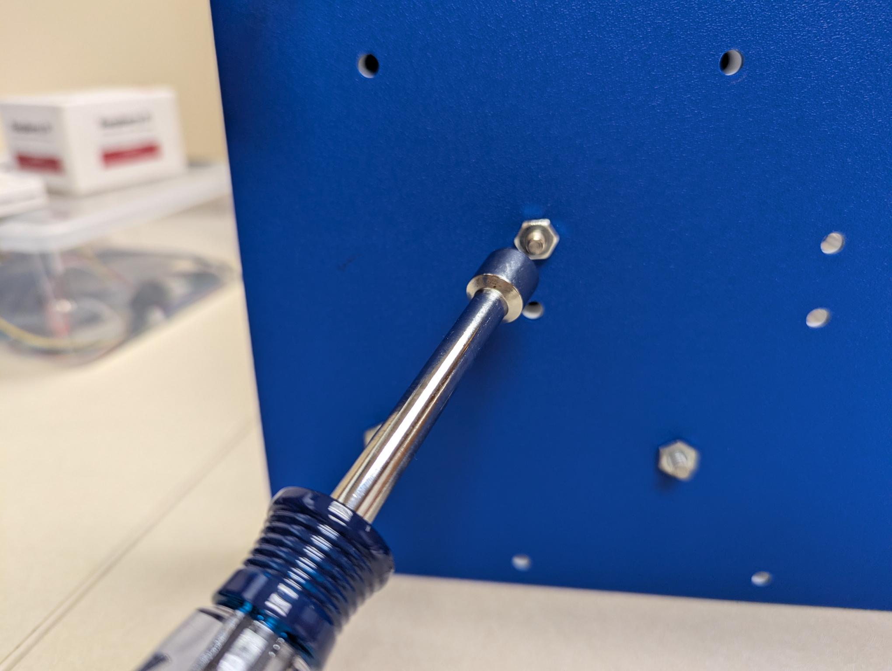
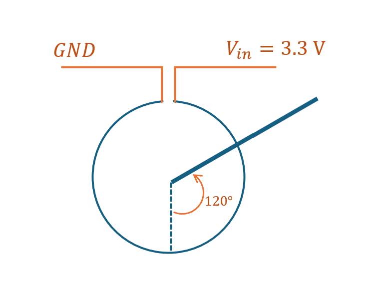

# Lab 10 Pendulum II

## :dart: Task 1 – Record Zero Input Response

---
### 📌 Task 1.1 Set-up
We will repeat the same set-up and wiring as the lab last week.

You should refer to the details in [Lab 9 Main Task 1](../Lab%209%20Pendulum%20I/Lab%209%20Main%20Task%201.md)

|  |  We got a new nut driver! |
|---------------------|------------------------------|
|  |  |
-----
Since you may get a different pendulum as last week. You should re-do the measurement for its downward center position.

#### :pencil2:  Report Item 1-a

Record the measured $V_{out}$ in the table.

| **Rotation**                      | **Theoretical $V_{out}$** | **Arduino Serial Monitor** | **Analog Discovery** |
|:------------:|:--------------:|:--------:|:--------:|
| 180° |               1.65 V                 |                            |                      |

---
### 📌 Task 1.2 Data Record

You can re-use your Arduino code from last week.

Now, 
* Bring to pendulum to **+120 Deg 0ffset from the downward position**. Make sure your pendulum is steady.
* Clear the Serial Monitor about 2–5 seconds before releasing. This helps you capture some initial-time data without recording an unnecessarily long time.
* Release the pendulum at +120 Deg. Let it swing freely,
* After the pendulum comes to rest (no longer moving), quickly unplug the USB cable to stop the Serial Monitor recording.

Once finished, export your Serial Monitor data from a `.txt` file, same as last week.

|        | 
|:------------:|
| |   
|Tip: +120 Deg position is just the 2 o’clock on a clock face.    |

---
### 📌 Task 1.3 Visualize Data in Python

Once you saved the .txt file, use Python to load and visualize the data.

#### :pencil2:  Report Item 1-b

In Python, plot the **Pendulum Offset Angle (Deg)** versus **Time (s)** using your experimental data. 

Show code and figure. The figure should have proper title, x/y axis labels, units.

-------
### ✅ No Check Point

You can still check your plot with instructor/TA if you want to.

