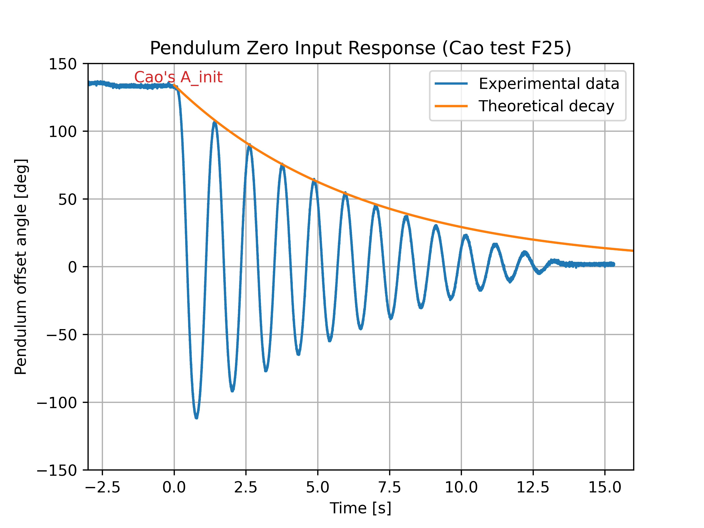

# Lab 10 Pendulum II 

## :dart: Task 2 – Fine-adjust Physics Parameter (Individual)

---
### 📌 Task 2.1 Fine-adjust Physics Parameter (Individual)

You have calculated the physics parameters from the last lab.
- $l$: pendulum length (unit: m)
- $b$: friction parameter (unit: N·m·s/rad)

The pendulum length $l$ is fixed. But the friction parameter $b$ will vary a little if you swing (realease) at different degrees.

This task requires you to fine-adjust the friction parameter $b$ based on the recorded data.

To do so, plot these on on the same figure:
* **Pendulum Offset Angle (Deg) versus Time (s)**, using your experimental data. 
  In addition, shift your time data, such as your releasing exactly happens at 0 second.
* **The theoretical Exponential decay in Deg:**
  
$$A_{\text{init}} e^{-\zeta \omega_n t} = A_{\text{init}} e^{-\frac{b}{2 m l^2} t}$$

   where:
   - $$A_{\text{init}}$$ is the **initial angle (in degrees)** at the moment of release. You should inspect from the experimental data.
   - $A_{\text{init}}$ cannot be exactly 120.0 Deg in practice due to human error.
   - Set $l = 0.271$ (always fixed)
   - Set $b = 0.001$ (to be adjusted later)

Once plotted, you may find the peaks of two traces are not well aligned. 
Fine-adjust your $b$ value in a small range until they are well aligned in a few beginning peaks. You don't need to care about the tailing portion.

| This is my example plot | 
|---------------------|
|  | 

https://github.com/user-attachments/assets/22d7338b-b631-41de-a610-c87ce21054ab

------
#### :pencil2:  Report Item 2-a

In Python, plot the 2  required signals on the same figure.

Show code and figure. The figure should have proper title, x/y axis labels, units.

> [!NOTE]
> When you plot experiment VS theory, do not use the experimental time array directly to your theoretical signal.
>
> Always create a new, clean time array for the theory calculation (such as `t_theo= np.linspace()`)
 
> [!NOTE]
> Do not manipulate your dataframe like: `yourdataframe['column_name'] = 2 * yourdataframe['column_name']`
>
> This will overwrite your original data.
>
> Instead, assign to a new variable `new_variable = 2 * yourdataframe['column_name']`, or create a new column `yourdataframe['new_column_name'] = 2 * yourdataframe['column_name']`

------
#### :pencil2:  Report Item 2-b
Create a Markdown cell, state your final values for
* $A_{\text{init}}$
* $b$

-------
### ✅ Check Point 1 — Python Plot

Show to your instructor/TA.
